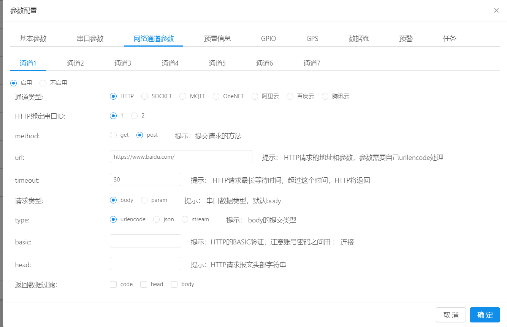
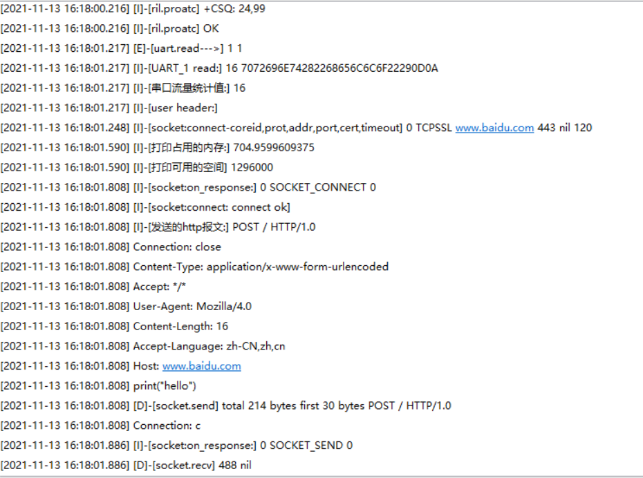
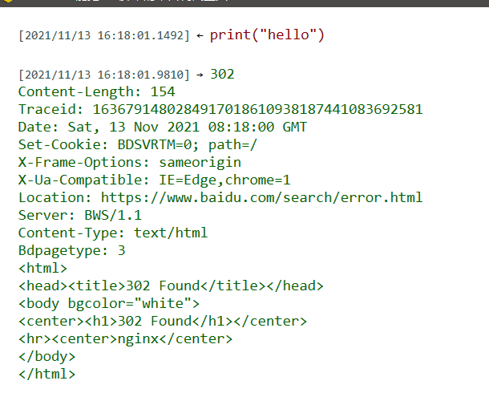

# HTTP 透传

* 操作步骤：
  1.  打开DTU配置界面，选择**网络通道参数**，打开任意通道，通道类型选择**HTTP**,绑定的串口ID根据用户实际需求进行选择。
   
  2.  选择提交请求的方法
   
      2.1 **method**：有get和post两种类型供用户选择，默认为post

      2.2 **url** ：HTTP请求的地址和参数

      2.3 **超时时间**：（HTTP请求最长等待时间，超过这个时间，HTTP将返回，默认为30S） 

      2.4 **请求类型**：用户通过串口发送给服务器的数据的数据类型

      2.5 **type**：body的提交类型，有urlencode(普通字符串)、json(json字符串)、stream(二进制文本，图片、音频文件等)

  3. 通过串口发送body，即可获得HTTP的server的回应。 
* 日志打印：
-[---------------------- 网络注册已成功 ----------------------]
-[----------------------- HTTP is start! --------------------------------------]

* 截图：

* 注意事项

1. HTTP是无状态的短链接，服务器无法主动给模块下发，由模块主动给HTTP的Server发消息，而HTTP的Server被动的返回一个参数

2. URL这里，如果是https的话，一定要仔细写好，默认添加SSL，若不填的话就是默认的http请求
