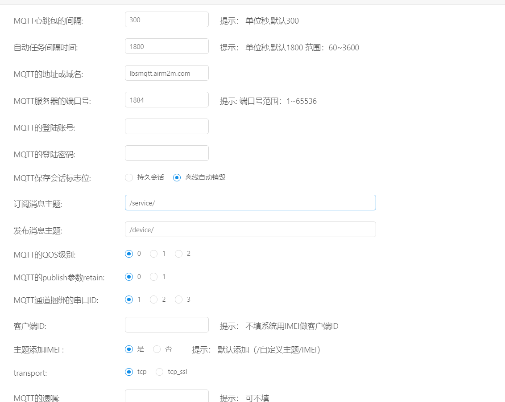
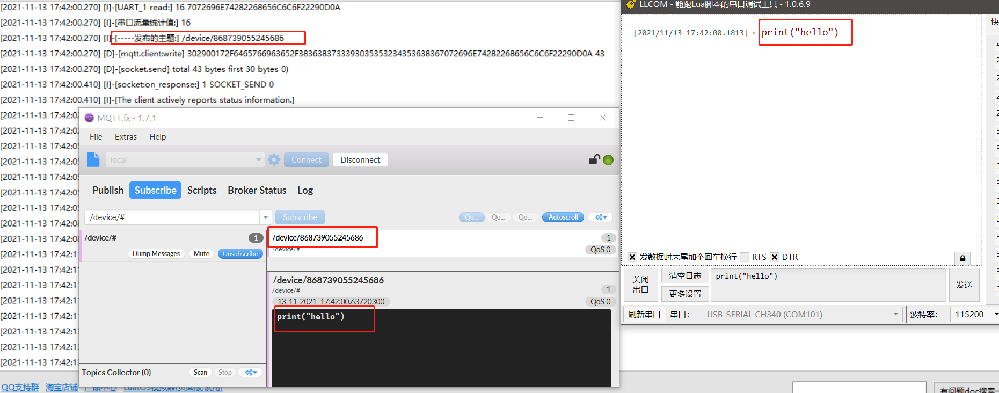
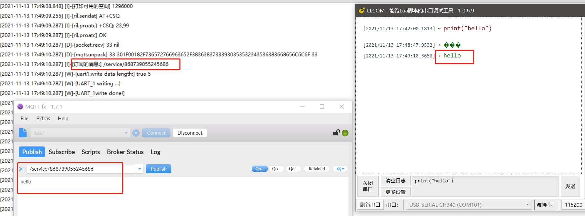

# MQTT 透传

* 操作步骤：
  1. 基本参数配置前面已有所介绍，在这重点讲一下网络通道参数里的几个重要参数：**MQTT心跳包的间隔**默认为300秒(保活)

  2. **MQTT的地址或域名**，以及**MQTT服务器的端口号**，为了方便测试，我们提供了一个免费的MQTT服务器供用户测试，无账号和密码限制，实际项目中，用户根据自己的MQTT服务器设置进行选择填写。（MQTT服务器的地址为 lbsmqtt.airm2m.com，端口号为1884）
  3. **MQTT保存会话标志位**：根据用户实际需求选持久会话或离线自动销毁

  4. **消息订阅与发布**：本文中为了演示方便，选择了\device\和\service\，实际项目中根据用户实际需求设置

  5. **主题添加IMEI**：为了区分发布的数据时从哪台设备中来的，可以勾选**主题添加IMEI**，如果客户端只想订阅某一模块发布的消息，可以在MQTT客户端中订阅如下主题：**/自定义主题/IMEI**，默认主题添加IMEI，用户根据实际需求自行选择。

  6. 配置成功后点击确定，重启设备，打开MQTT工具（这里使用的是MQTT.FX），连接上对应的地址，配置MQTT的订阅主题为 **/用户自定义主题/#**,配置MQTT发布主题为 **/用户自定义主题/IMEI**(注：#为订阅上级主题发布的所有消息，通常用于调试过程)
* 日志打印：
-[---------------------- 网络注册已成功 ----------------------]
-[----------------------- MQTT is start! --------------------------------------]
-[-----发布的主题:] /device/imei
-[订阅的消息:] /service/imei

* 截图：

