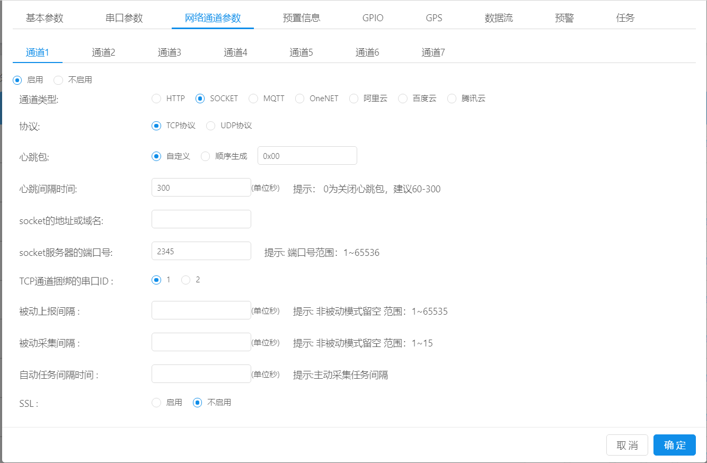
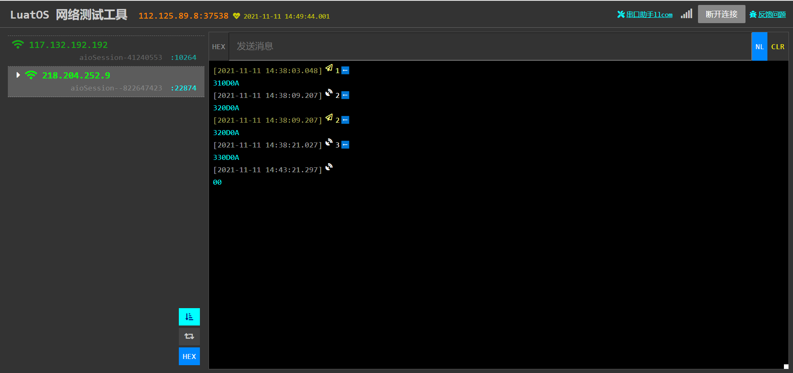

# TCP/UDP 透传

注：合宙提供了一个免费的TCP/UDP测试服务器，用户可用来测试TCP/udp服务器的操作。https://netlab.luatos.com/
* 操作步骤：
1.DTU管理系统：
     DTU管理系统->设备管理->分组管理->添加分组
     添加分组后点击查看，通过绑定IMEI号来绑定设备。

 2. 打开DTU管理系统，基本参数配置前面已经有所介绍，这里重点介绍网络通道参数：

 
    选择socket通道、TCP协议，心跳包可以自定义，图中是选择了自定义，每隔一段时间会向TCP服务器发送IMEI号，下面的心跳间隔时间与此对应。
    接着填上TCP服务器的地址以及端口号，**TCP通道捆绑的串口ID即为基本参数配置时开启的串口通道**，要一一对应。
    最后点击确定就完成了DTU参数配置。
 3. 给板子烧录DTU固件，打开串口工具，以及TCP服务器页面，可以看到，串口能发送数据到TCP服务器端，TCP服务器也能下发数据到模块串口，而且模块会每隔一分钟
向TCP服务器发送0X00，如图所示

* 日志打印：
    -[---------------------- 网络注册已成功 ----------------------]

    -[----------------------- TCP/UDP is start! --------------------------------------]

* 注意事项：注意添加设备时确保IMEI的正确，否则设备无法绑定DTU，相应的功能就无法实现。
