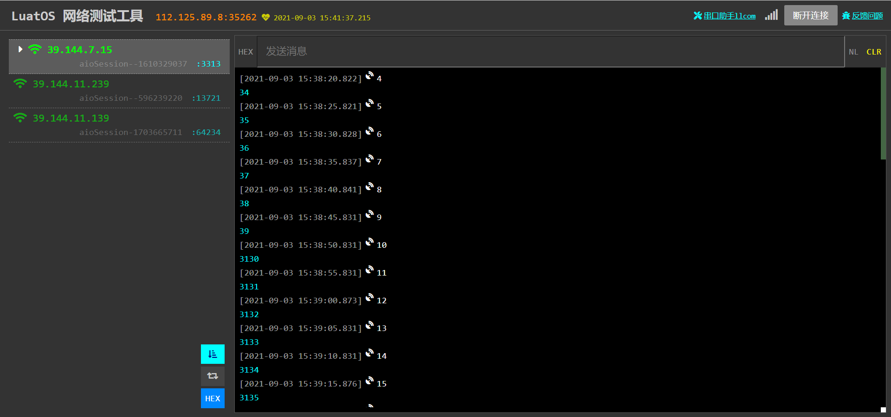

# **任务**

## **基础概念介绍**

**任务**在脚本层可以解释为一个task，当用户开启一个**任务**等同与在脚本层新建了一个task，所以在用户启用**任务**功能之前，建议用户先熟悉luat的基础语法，[点击此处](https://doc.openluat.com/wiki/3?wiki_page_id=606)即可进行luat基础语法的学习。

## **使用方法**

**任务**的使用需要谨慎，按照如下固定格式来写

```lua
    function
    --用户自定义代码
    end
```

例如

```lua
function
    --定义一个叫做count的变量，并使它的初始值为0
    local count=0
    --进入一个循环
    while true do
        --发布一个消息给串口1，输出count变量的值
        --如需发布消息给其他串口，仅需把下文中的NET_RECV_WAIT_1中的1和后面逗号的1换成其他串口号
        sys.publish("NET_RECV_WAIT_1",1,tostring(count))
        --令count的值自增1
        count = count +1  
        --发布一个消息到网络通道1，同样输出count变量的值
        --如需发送到其他网络通道，仅需把下文中的ET_SENT_RDY_1中的1，换成其他网络通道号
        sys.publish("NET_SENT_RDY_1",tostring(count))
        --延时5s
        sys.wait(5000)
    end
end
```

最终效果如下图所示



在**任务**里可以完成一些拓展功能，比如**免MCU**使用模块的iic接口去读取并处理传感器数据，就可以在**任务**里处理（建议将传感器驱动放在iic.lua文件里）。
例如：客户在iic.lua中写了一个叫sht30的函数，并return了返回值，我们就可以在**任务**中去读取到返回值，**任务**代码如下所示**。

```lua
function
    --定义一个叫做temp和hump的变量，并使它们的初始值为0
    local temp=0
    local hump=0
    --进入一个循环
    while true do
    temp,hump = iic.sht30()
        --发布一个消息给串口，输出temp和hump的值
        sys.publish("NET_RECV_WAIT_1",tostring(temp),tostring(hump))
        --发布一个消息到服务器，同样输出temp和hump的值
        sys.publish("NET_SENT_RDY_1",tostring(temp),tostring(hump))
        --延时5s
        sys.wait(5000)
    end
end
```

当传感器和模块连线正确且传感器和模块均在正常工作的时候，服务器和串口都能收到这条带有temp和hump的消息。
以上两个演示仅是**任务**的实例demo，用户可根据自己的实际需要去写自己的**任务**
