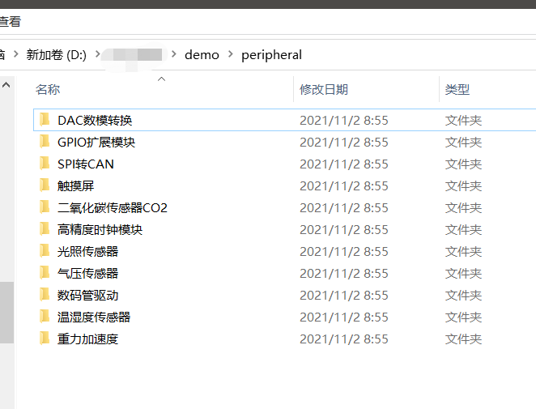
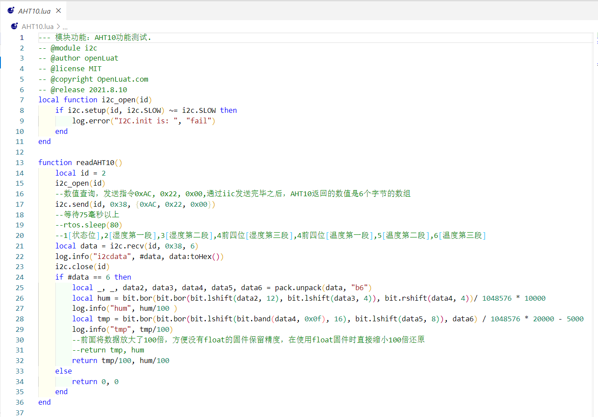
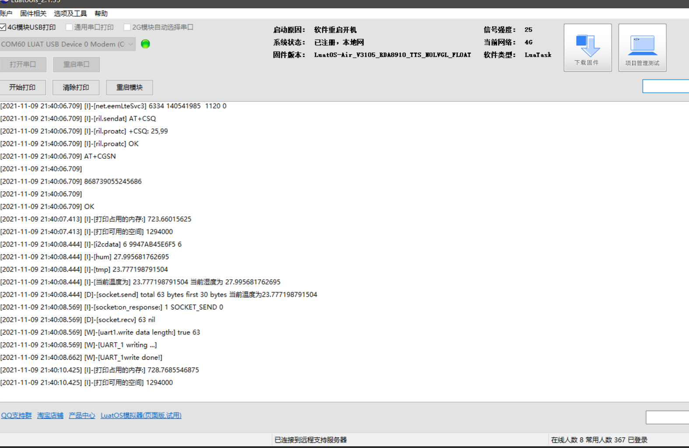
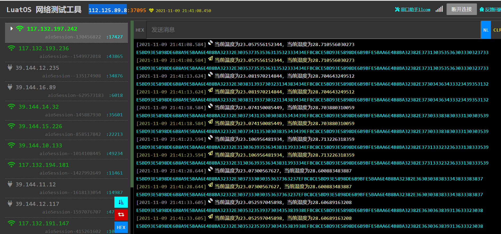
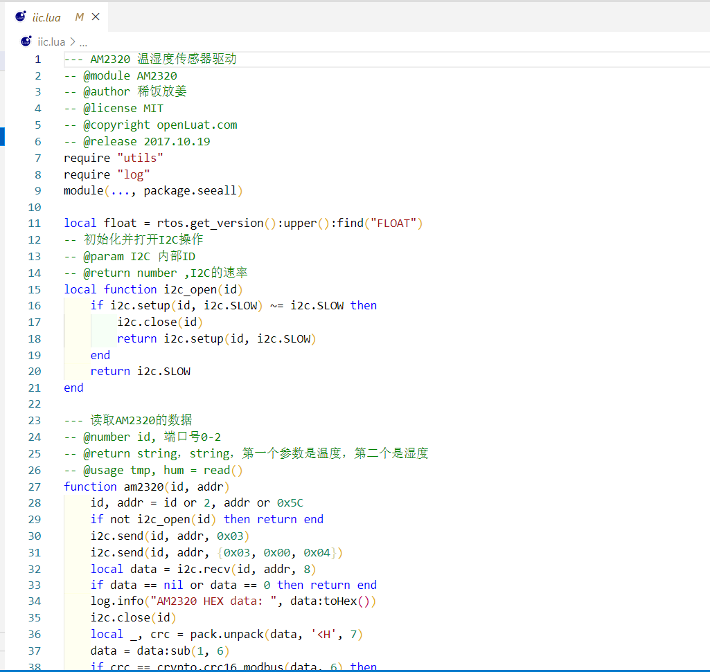

# **传感器的适配**

## **基础概念介绍**

传感器的适配其实是**任务**功能的另一种方式的应用

## **使用方法**

**任务**的使用需要谨慎，按照如下固定格式来写

```lua
    function
    --用户自定义代码
    end
```

适配传感器有两种方法：

    1.在"任务"里把传感器的驱动代码全部写进去
        优点：无需改源码
        缺点：任务看起来较长，有可能会出现用户误操作（删除/添加某字符），且找问题时不方便。
    2.修改源码（在iic.lua里单独添加传感器的驱动文件，任务里只需要调用该函数即可）
        优点：排查问题方便，且任务部分代码不多，方便用户查看
        缺点：需要改源码

接下来本文将会详细描述这两种方法，用户更具实际需求自行选择。

## 一、在"任务"里把传感器的驱动代码全部写进去

首先，我们需要去获取传感器的驱动代码，[点击这里](https://doc.openluat.com/article/1334#Luat_95),选择下载上传脚本包，选择最新版本(LuaTask_V2.4.1及其以上的才有合宙适配过的传感器，如果没有2.4.1及其以上版本，或者没有你想要的传感器，可以联系对应的销售或者加合宙任意官方群，联系任意FAE/销售，会有人联系您)，传感器的驱动代码在demo-peripheral里，用户根据实际需要，自行选择对应的iic传感器代码。


演示方便起见，我这里选择了最为常见的温湿度传感器AHT10，打开AHT10即可看见如图所示代码

这里有两种修改方法，一种是把从第七行（local function i2c_open(id)）开始的，到最后sys.timerLoopStart(readAHT10,2000)这行前一行，全部复制粘贴到**任务**里。

或者只复制function readAHT10()这个函数，然后把这个函数中第三行i2c_open(id)，更改为iic.i2c_open(id)

特别提醒，local id = 2 仅在724生效

    -- 8910开发板 I2C通道2/SPI通道1 2/ADC通道2 3
    -- 1603开发板 I2C通道1 2 3 4/SPI通道0 1 2/ADC通道1 2

在**任务**中添加完上述两段以后，需要将模块的iic接口和传感器接口一一对应，AHT10即可采集数据。

但是因为我们没有在任务里写如何处理传感器发送给模块的数据，所以luatools和服务器都不会收到传感器采集到的数据，所以我们还需要再给任务里加一段处理传感器发送给模块的数据。这里我选择循环5S，日志中打印一次温湿度数据，并发送给服务器，所以我写了一个定时器，定时器代码如下：

```lua
    sys.timerLoopStart(function()
    --开启一个循环定时器，每5S循环执行一次
    local tmp,hum= readAHT10()
    --定义 tmp和hum变量，并把readAHT10函数的返回值赋给它们
    log.info("当前温度为",tostring(tmp),"当前湿度为",tostring(hum))
    --日志中打印当前温度和当前湿度
    sys.publish("NET_SENT_RDY_1","当前温度为"..tostring(tmp).."，当前湿度为"..tostring(hum))
    --发布一条消息给服务器，消息内容为当前温湿度
    end, 5000)
```

以上就是方法一，所以实际上需要在任务里复制粘贴的代码如下

```lua
function
local float = rtos.get_version():upper():find("FLOAT")
-- 初始化并打开I2C操作
-- @param I2C 内部ID
-- @return number ,I2C的速率
local function i2c_open(id)
    if i2c.setup(id, i2c.SLOW) ~= i2c.SLOW then
        i2c.close(id)
        return i2c.setup(id, i2c.SLOW)
    end
    return i2c.SLOW
end
 function readAHT10()
    local id = id or 2
    i2c_open(id)
    --数值查询，发送指令0xAC, 0x22, 0x00,通过iic发送完毕之后，AHT10返回的数值是6个字节的数组
    i2c.send(id, 0x38, {0xAC, 0x22, 0x00})
    --等待75毫秒以上
    --rtos.sleep(80)
    --1[状态位],2[湿度第一段],3[湿度第二段],4前四位[湿度第三段],4前四位[温度第一段],5[温度第二段],6[温度第三段]
    local data = i2c.recv(id, 0x38, 6)
    log.info("i2cdata", #data, data:toHex())
    i2c.close(id)
    if #data == 6 then
        local _, _, data2, data3, data4, data5, data6 = pack.unpack(data, "b6")
        local hum = bit.bor(bit.bor(bit.lshift(data2, 12), bit.lshift(data3, 4)), bit.rshift(data4, 4))/ 1048576 * 10000
        log.info("hum", hum/100 )
        local tmp = bit.bor(bit.bor(bit.lshift(bit.band(data4, 0x0f), 16), bit.lshift(data5, 8)), data6) / 1048576 * 20000 - 5000
        log.info("tmp", tmp/100)
        --前面将数据放大了100倍，方便没有float的固件保留精度，在使用float固件时直接缩小100倍还原
        --return tmp, hum
        return tmp/100, hum/100
    else
        return 0, 0
    end
end
sys.timerLoopStart(function()
local tmp,hum= readAHT10()
log.info("当前温度为",tostring(tmp),"当前湿度为",tostring(hum))
sys.publish("NET_SENT_RDY_1","当前温度为"..tostring(tmp).."，当前湿度为"..tostring(hum))end, 5000)
end
```

实际演示效果如下



## 二、修改源码

首先，我们需要明确源码位置（https://gitee.com/hotdll/iRTU）

下载好源码后，打开**USER**目录，即可看到一个叫**iic.lua**的文件，这个文件就是我们需要修改的文件。

双击打开该文件可以看到如下内容：

可以看到该文件中其实已经有两个传感器的驱动了，一个是AM2320的驱动，一个是SHT21 驱动，本文还是以添加AHT10驱动为例。

首先，我们需要去获取传感器的驱动代码，[点击这里](https://doc.openluat.com/article/1334#Luat_95),选择下载上传脚本包，选择最新版本(LuaTask_V2.4.1及其以上的才有合宙适配过的传感器，如果没有2.4.1及其以上版本，或者没有你想要的传感器，可以联系对应的销售或者加合宙任意官方群，联系任意FAE/销售，会有人联系您)，传感器的驱动代码在demo-peripheral里，用户根据实际需要，自行选择对应的iic传感器代码。

打开AHT10.lua文件可以看到如下内容：

我们需要做的既是把从第13行（function readAHT10()）开始的到最后一个end结束的所有代码复制粘贴到iic.lua里。粘贴结束后，iic.lua文件里的内容应该是如下所示。

```lua
--- AM2320 温湿度传感器驱动
-- @module AM2320
-- @author 稀饭放姜
-- @license MIT
-- @copyright openLuat.com
-- @release 2017.10.19
require "utils"
require "log"
module(..., package.seeall)

local float = rtos.get_version():upper():find("FLOAT")
-- 初始化并打开I2C操作
-- @param I2C 内部ID
-- @return number ,I2C的速率
local function i2c_open(id)
    if i2c.setup(id, i2c.SLOW) ~= i2c.SLOW then
        i2c.close(id)
        return i2c.setup(id, i2c.SLOW)
    end
    return i2c.SLOW
end

--- 读取AM2320的数据
-- @number id, 端口号0-2
-- @return string，string，第一个参数是温度，第二个是湿度
-- @usage tmp, hum = read()
function am2320(id, addr)
    id, addr = id or 2, addr or 0x5C
    if not i2c_open(id) then return end
    i2c.send(id, addr, 0x03)
    i2c.send(id, addr, {0x03, 0x00, 0x04})
    local data = i2c.recv(id, addr, 8)
    if data == nil or data == 0 then return end
    log.info("AM2320 HEX data: ", data:toHex())
    i2c.close(id)
    local _, crc = pack.unpack(data, '<H', 7)
    data = data:sub(1, 6)
    if crc == crypto.crc16_modbus(data, 6) then
        local _, hum, tmp = pack.unpack(string.sub(data, 3, -1), '>H2')
        if tmp == nil or hum == nil then return 0, 0 end
        if tmp >= 0x8000 then tmp = 0x8000 - tmp end
        if float then
            tmp, hum = tmp / 10, hum / 10
        else
            tmp = tmp / 10 .. "." .. tmp % 10
            hum = hum / 10 .. "." .. hum % 10
        end
        log.info("AM2320 data: ", tmp, hum)
        return tmp, hum
    end
end

--- 读取SHT21的数据
-- @number id, 端口号0-2
-- @return string，string，第一个参数是温度，第二个是湿度
-- @usage tmp, hum = sht()
function sht(id, addr)
    local _, tmp, hum
    id, addr = id or 2, addr or 0x40
    if not i2c_open(id) then return end
    i2c.send(id, addr, 0xE3)
    tmp = i2c.recv(id, addr, 2)
    log.info("SHT读取到的温度寄存器24位值:", tmp:toHex())
    i2c.send(id, addr, 0xE5)
    hum = i2c.recv(id, addr, 2)
    log.info("SHT读取到的湿度寄存器24位值:", hum:toHex())
    i2c.close(id)
    _, tmp = pack.unpack(tmp, '>H')
    _, hum = pack.unpack(hum, '>H')
    if tmp == nil or hum == nil then return 0, 0 end
    tmp = bit.band(tmp, 0xFFFC)
    hum = bit.band(hum, 0xFFFC)
    if float then
        hum = (hum * 12500 / 65536 - 600) / 100
        tmp = (tmp * 17572 / 65536 - 4685) / 100
    else
        tmp = tmp * 17572 / 65536 - 4685
        hum = hum * 12500 / 65536 - 600
        tmp = tmp / 100 .. "." .. tmp % 100
        hum = hum / 100 .. "." .. hum % 100
    end
    log.info("当前温度是:", tmp, "当前湿度是:", hum .. "%")
    return tmp, hum
end

--- 读取AHT10的数据
-- @number id, 端口号0-2
-- @return string，string，第一个参数是温度，第二个是湿度
-- @usage tmp, hum = readAHT10()
function readAHT10()
    --特别提醒，local id = 2 仅在724生效
    -- 8910开发板 I2C通道2/SPI通道1 2/ADC通道2 3
    -- 1603开发板 I2C通道1 2 3 4/SPI通道0 1 2/ADC通道1 2
    local id = 2
    i2c_open(id)
    --数值查询，发送指令0xAC, 0x22, 0x00,通过iic发送完毕之后，AHT10返回的数值是6个字节的数组
    i2c.send(id, 0x38, {0xAC, 0x22, 0x00})
    --等待75毫秒以上
    --rtos.sleep(80)
    --1[状态位],2[湿度第一段],3[湿度第二段],4前四位[湿度第三段],4前四位[温度第一段],5[温度第二段],6[温度第三段]
    local data = i2c.recv(id, 0x38, 6)
    log.info("i2cdata", #data, data:toHex())
    i2c.close(id)
    if #data == 6 then
        local _, _, data2, data3, data4, data5, data6 = pack.unpack(data, "b6")
        local hum = bit.bor(bit.bor(bit.lshift(data2, 12), bit.lshift(data3, 4)), bit.rshift(data4, 4))/ 1048576 * 10000
        log.info("hum", hum/100 )
        local tmp = bit.bor(bit.bor(bit.lshift(bit.band(data4, 0x0f), 16), bit.lshift(data5, 8)), data6) / 1048576 * 20000 - 5000
        log.info("tmp", tmp/100)
        --前面将数据放大了100倍，方便没有float的固件保留精度，在使用float固件时直接缩小100倍还原
        --return tmp, hum
        return tmp/100, hum/100
    else
        return 0, 0
    end
end
```

然后将修改后的文件与固件重新打包生成量产文件烧录在模块里即可。
使用这种方法，同样要用到**任务**，因为我们刚刚只是添加了驱动，并没有在任意地方调用该函数，所以，如果希望将传感器的数据发送给服务器，同样需要我们在**任务**中去处理。
打开web端/本地配置中的**任务**，将如下代码复制粘贴进去，即可实现5S一次，将传感器数据发送给服务器。

```lua
function
--启动一个循环定时器
sys.timerLoopStart(function()
--定义两个变量用来接收温湿度的值
local tmp,hum= iic.readAHT10()
--打印温湿度的值
log.info("当前温度为",tostring(tmp),"当前湿度为",tostring(hum))
--向当前连接的服务器发布一条含有温湿度数据的消息
sys.publish("NET_SENT_RDY_1","当前温度为"..tostring(tmp).."，当前湿度为"..tostring(hum))end, 5000)
--如果数据需要特定格式的校验，可以将双引号中的当前温度为和当前湿度为改成需要校验的字符或字符串
end
```

修改完成后，即可在luatools和服务器上看到如下内容：

