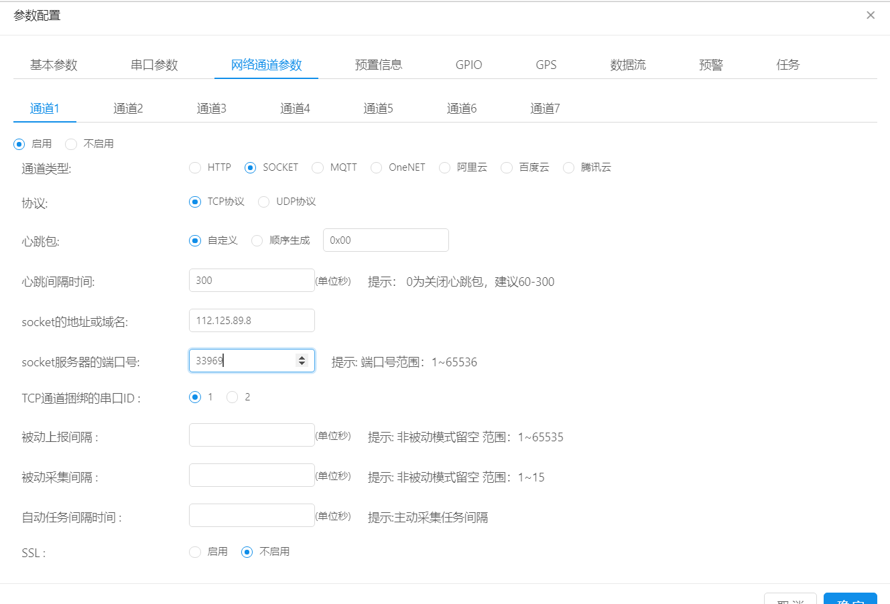
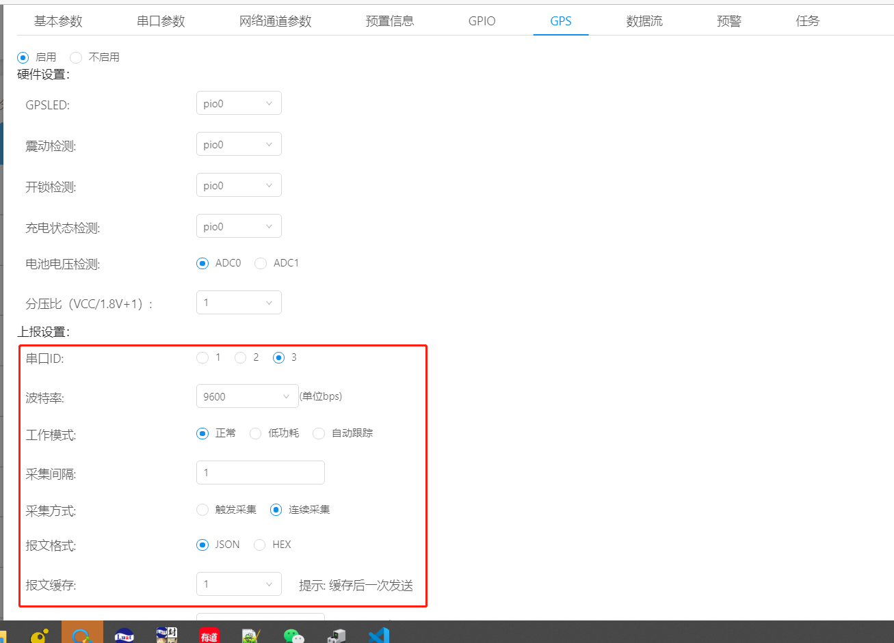
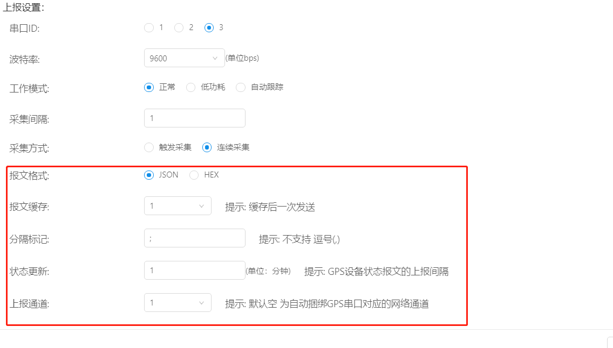
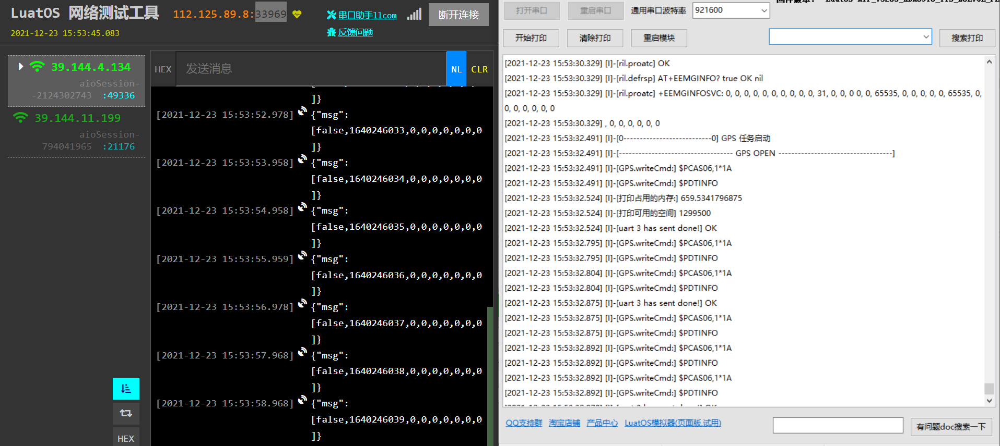

# 使用AIR820将GPS发送给服务器

进入[DTU管理界面](https://dtu.openluat.com)

**基础参数**配置在前面有介绍就不多说了，用户根据实际需求进行填写

**配置网络通道参数**,为了演示方便，本文使用的是TCP服务器，实际项目中用户根据自己的实际需求进行选择。

网络配置参数如下所示,关于参数的具体意义前文tcp_udp透传中有说过，这里不做过多解释了。

在这里注意，当启用GPS的时候如果对应的GPS串口和你打开的串口参数会冲突，所以用户的GPS接哪个串口，在串口参数里就不要启用哪个串口，820内部的GPS波特率为9600，和820主芯片之间使用的是串口三通讯

**GPS**：硬件设计不用管，这里是为外接GPS设计的，820不需要这些配置，选择默认即可。

**串口ID选择**：串口三

**波特率**：9600
820暂不支持低功耗模式和自动追踪模式，此项配置无效。如果客户有需求，可发送"rrpc,gps_wakeup"和"rrpc,gps_getmsg,json"或"rrpc,gps_getmsg,hex"远程关闭/打开GPS

**报文格式**：可以按用户实际需求设置，一般采用json报文的形式

**分割标记**：指上下两包GPS报文中间用什么间隔开，一般使用";"英文的分号间隔(注：这里如果不填，luatools的日志打印可能会报错)
**上报通道**：因为网络通道参数里只有串口一和串口二，所以这里需要指明下用户绑定的网络通道

单击确定，即可完成所有配置。

接下来给模块上电/重启，在设备上电情况下也可以通过串口/其他服务器端给模块发送rrpc,upconfig命令（串口端还可以发送+++命令），让设备读取到最新的参数配置即可。

当模块检测到参数配置有更新的情况下，会去更新自己的参数，然后重启设备。重启之后就会去链接对应的云平台，如果这时你的设备开启了日志打印且设备直连电脑，luatools打开且日志输出正常的情况下，会观察到luatools打印了下面截图的红框部分，证明GPS打开成功，对应的服务器上也会收到响应的消息

