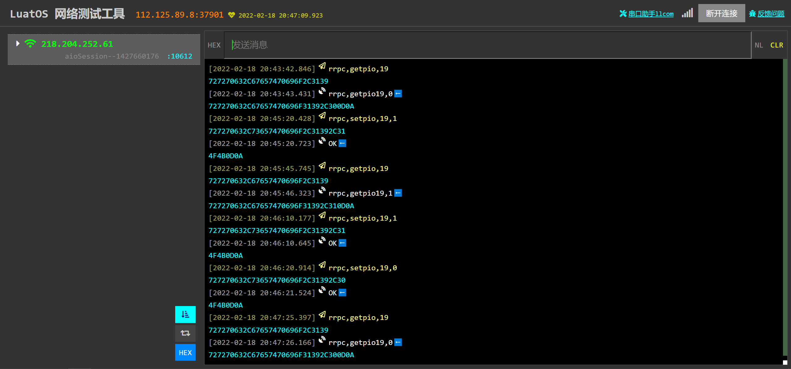

# 远程发送指令控制GPIO

DTU有两种方式控制模块对应的GPIO，一种iRTU原生指令控制，另一种是使用数据流的方式控制GPIO，两种方式都可以，原生指令控制简单易于理解，掉电后不会保存状态，使用数据流可以让用户主动控制下发命令的格式，用户根据实际需求自行选择。

本文采取的是TCP服务器，关于TCP服务器的配置以及各项参数的具体含义本文不做过多讲解，用户自行翻阅本目录下 《TCP_UDP透传》一文查看，本文只贴出我的配置参数


## iRTU原生指令

原生指令比较简单，客户使用该指令前可以参考固件手手册中的远程控制GPIO表，查看对应模块可以控制的GPIO有哪些。
在设置前可以先使用**rrpc,getpio,GPIO号**查询对应GPIO现在的状态

然后使用**rrpc,setpio,GPIO号,0/1**上下拉对应的GPIO号

本文使用GPIO19做演示，从下图可以看到，GPIO19上电初始化状态为下拉，使用**rrpc,setpio,19,1**命令以后，模块返回ok，对应的io口电压也从0变为了1.8V，这时再去查询该GPIO状态，则可以看到模块返回**rrpc,getpio19,1**




## 用户自定义指令

用户自定义指令则需要用到**接收数据流模板**，关于数据流模板的介绍查看同目录下文章**《数据流》**，在这里不做过多阐述。

用到的函数只有一个
**pins.setup(pin, val, pull)**下面是对该函数的具体使用用法介绍

```lua

参数一(pin):GPIO ID
    GPIO 0到GPIO 31表示为pio.P0_0到pio.P0_31
    GPIO 32到GPIO XX表示为pio.P1_0到pio.P1_(XX-32)，例如GPIO33 表示为pio.P1_1
    GPIO 64到GPIO XX表示为pio.P2_0到pio.P2_(XX-64)，例如GPIO65 表示为pio.P2_1
参数二(val):number、nil或者function类型
    配置为输出模式时，为number类型，表示默认电平，0是低电平，1是高电平
    配置为输入模式时，为nil
    配置为中断模式时，为function类型，表示中断处理函数
参数三(pull): srt类型
    pio.PULLUP：上拉模式，io.PULLDOWN：下拉模式，pio.NOPULL：高阻态
    如果没有设置此参数，默认的上下拉参考模块的硬件设计说明书
```

直接上代码，用户根据自己的需求自行更改代码逻辑。

```lua
function--数据流标准格式
local str = ...--定义一个字符用于接收服务器发过来的数据
if str == "用户自定义字符串" then--判断服务器发过来的数据是否是打开/关闭GPIO的命令
pins.setup(19, 1, pio.PULLDOWN)--设置GPIO19为高电平下拉模式
return "gpio19 set1"--向串口返回GPIO19已经被设置为高电平的信息
else
log.info("标准透传数据")--如果不是命令。则将服务器发送的数据原封不动的发送给串口
return str
end
end--数据流标准格式
```

如果用户想做复杂逻辑，例如判断自定义字符串中带的参数，可以使用string函数进行对应操作，关于字符串的使用，lua提供了很多种库，在这里简单介绍两种常见的，用户如果想深入了解，请看![这里][https://doc.openluat.com/wiki/3?wiki_page_id=671]。

```lua

string.sub()
--截取字符串，原型为：string.sub(s, i [, j])
-- 参数说明：
-- s：要截取的字符串。
-- i：截取开始位置。
-- j：截取结束位置，默认为 -1，最后一个字符。
-- 例：
-- print(string.sub("Hello Lua", 4, 7))
-- print(string.sub("Hello Lua", 2))
-- print(string.sub("Hello Lua", 2, 1))
-- print(string.sub("Hello Lua", -3, -1))

string.find()
--在特定的字符串里找字符或者子字符串
-- string.find (s, pattern [, init [, plain]])
-- 参数说明：
-- s:原始字符串
--pattern：需要的字符
--第三个参数init默认为1，表示从第几个字符开始匹配，当init为负数时，表示从s字符串的倒数第-init个字符处开始匹配。
--plain默认为false，当其为true时，只会把p看成一个字符串对待
--在一个指定的目标字符串 str 中搜索指定的内容 pattern，如果找到了一个匹配的子串，就会返回这个子串的起始索引和结束索引，不存在则返回 nil。
--例：string.find("Hello Lua user", "Lua", 1)
--返回值为7 9
```

下面提供了其他写法供用户参考

### 截取指令中的字符串并且进行打开和关闭的判定

```lua
function--数据流标准格式
--假设从服务器下发的数据为"gpio,19,open"/"gpio,19,close"
local str = ...--定义一个字符用于接收服务器发过来的数据
local GPIO_str = string.sub(str,1,4)--因为lua的数从1开始的，所以这里先截取前四位确认下发的是打开/关闭GPIO的命令
local GPIO_number = string.sub(str,6,7)--确认对应的GPIO号
local GPIO_cmd =string.sub(str,9,-1)--确认是打开还是关闭
if GPIO_str == "gpio" and GPIO_cmd == "open" then--判断服务器发过来的数据是否是打开GPIO的命令
pins.setup(GPIO_number, 1, pio.PULLDOWN)--设置GPIO19为高电平下拉模式
return "gpio"..GPIO_number.." set open"--向串口返回GPIO19已经被设置为高电平的信息
elseif GPIO_str =="gpio" and GPIO_cmd =="close" then --判断服务器发过来的数据是否是关闭GPIO的命令
pins.setup(GPIO_number, 0, pio.PULLDOWN)--设置GPIO19为低电平下拉模式
return "gpio"..GPIO_number.." set close"
else
log.info("标准透传数据")--如果不是命令。则将服务器发送的数据原封不动的发送给串口
return str
end
end--数据流标准格式

```

string.find()的使用同理，用户自行完善数据流的书写。
