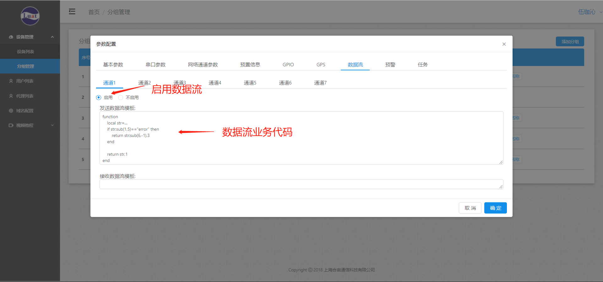
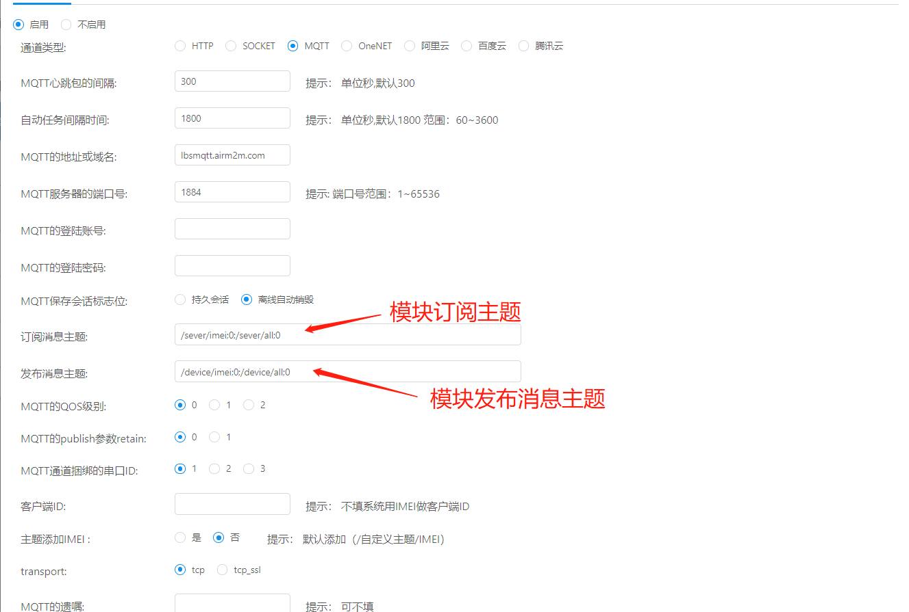
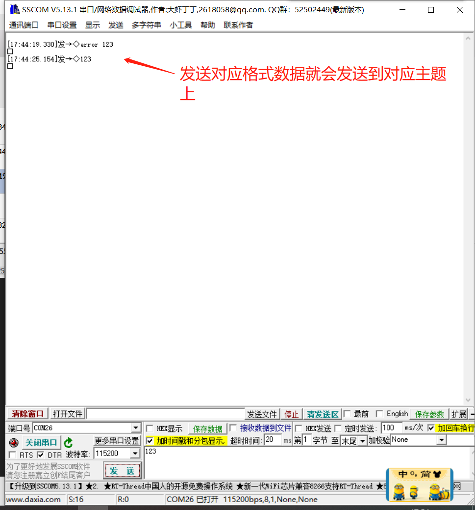
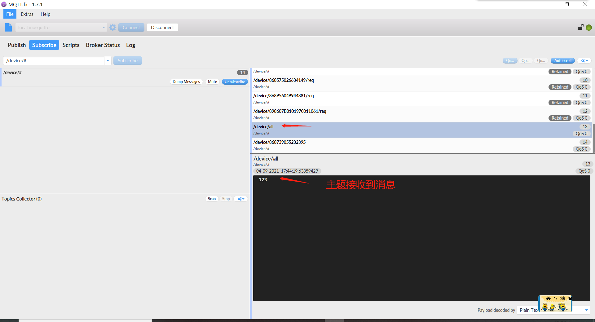
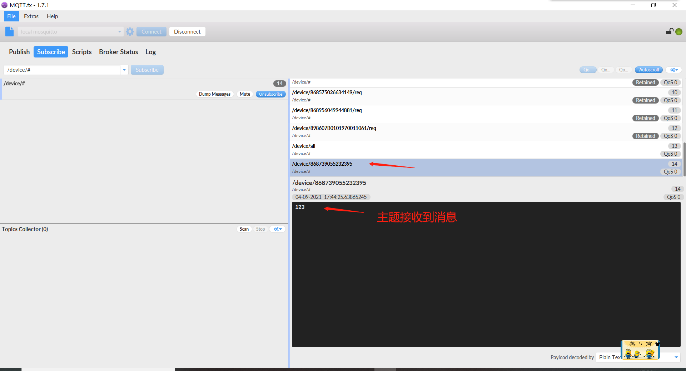
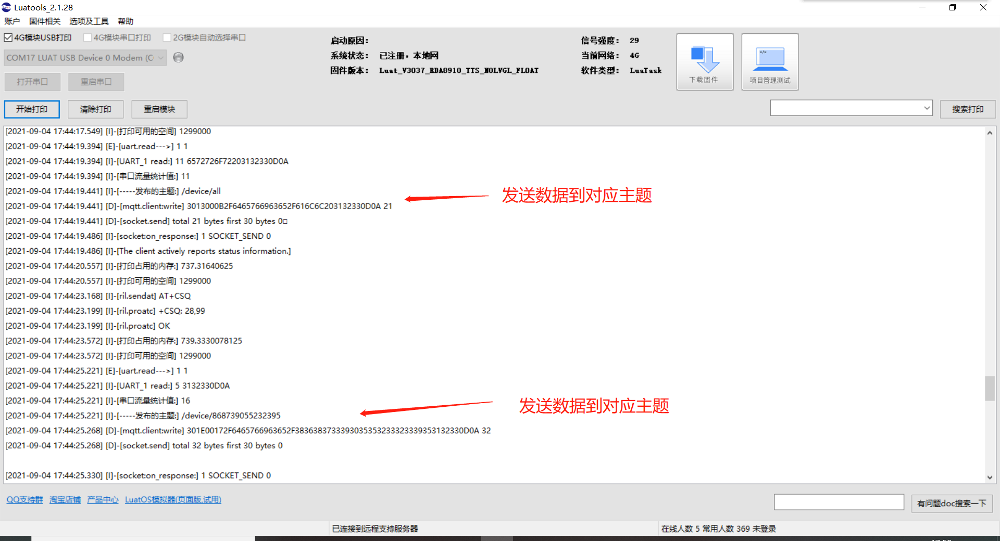

# 数据流

数据流可以将串口接收到的数据进行处理（例如将串口接收到的数据进行加减某个数，给数据帧前后添加固定的校验码等）后发送给服务器，总共有七路数据流，对应七路网络通道
## 操作步骤

此次以mqtt向多主题发送数据为例：



mqtt多主题格式：

topic1;qos;topic2;qos...(每个参数之间必须加；最后一个参数后不需要加；)

1             2      3         4（每个参数对应一位，依次递增）

测试代码如下：

```lua
function ()  --dtu固定格式（function()  代码 end）

  local str=...--接收的字符串

  if str:sub(1,5)=="error" then  --自定义格式

    return str:sub(6,-1),3  --返回值

  end

  return str,1  -- 返回值

end
```

### 修改参数



### 日志打印

重启模块后：








