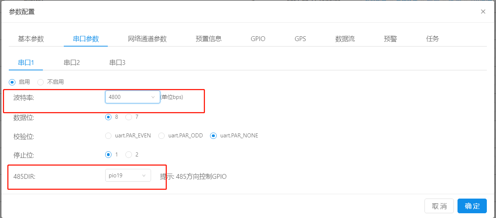
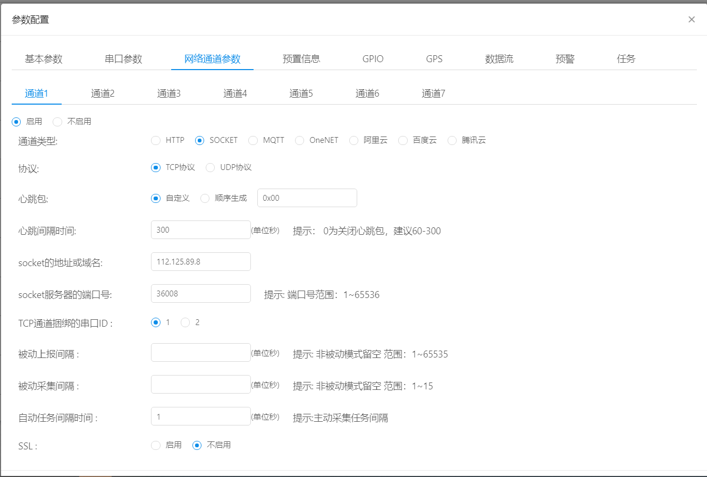
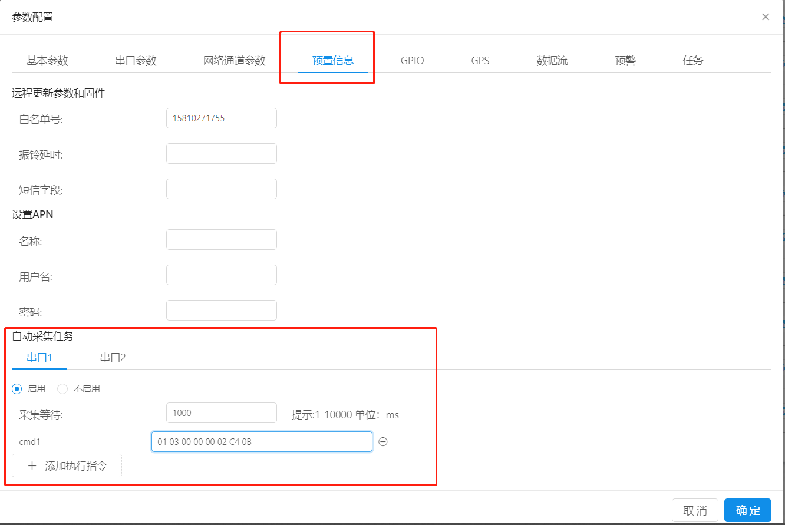
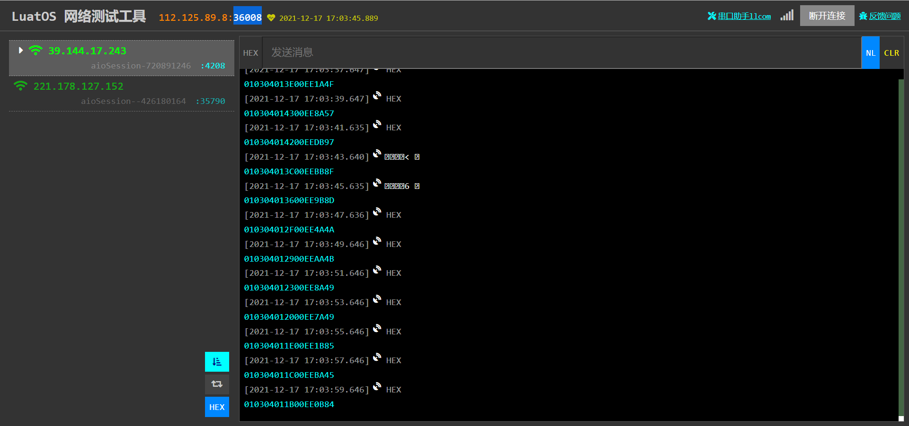
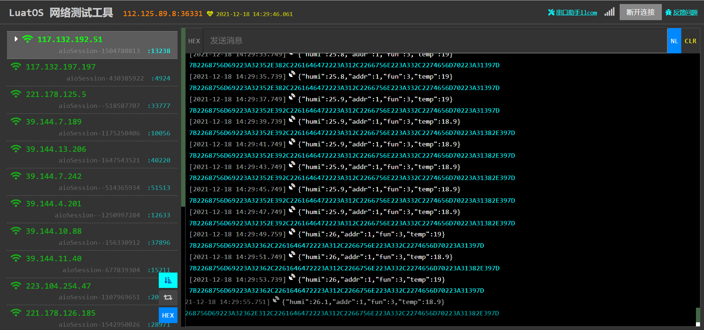

# 数据流解析modbus协议设备

485设备的modbus协议是iRTU常见的协议，本文将详细介绍iRTU如何给485设备下发查询指令，并解析设备上报的数据。

本文使用的设备为一个485型温湿度传感器，根据设备的使用手册可以看出，接好外部连接线以后，只需要给485型温湿度传感器发送十六进制的字符"01 03 00 00 00 02 C4 0B"，即可收到模块应答的十六进制的温湿度数据（"01 03 04 01 E6 FF 9F 1B A0"）。
下面详细解释下这两串字符串每一位都代表什么意思，以及客户接自己的传感器改如何进行数据的解析。
```
"01 03 00 00 00 02 C4 0B"这串字符串叫问询帧

01(地址码)

03(功能码：关于功能码的分类可以看https://www.jianshu.com/p/0f44d3b659e8)

00 00(起始地址)

00 02(数据长度)

C4 0B(校验码：前面所有字节按crc_modbus校验算法校验出来的数据应该何最后两位校验码一致)

```lua

不理解这一串字符具体含义也没关系，只要知道给设备发这串字符串过去，传感器会发送数据给模块即可,实际使用过程中，用户根据自己的485型设备具体的问询帧进行设置。

当我们发送了上面的问询帧后，485型设备工作正常时会给我们回复一个应答帧，这个应答帧就是我们要解析的数据了。下面以一个示例来解释，应答帧的组成。

"01 03 04 01 E6 FF 9F 1B A0" 应答帧
01(地址码)
03(功能码)
04(返回的有效字节数，意思为：从04以后，有4字节的数据为有效数据)
01 E6(湿度值，十六进制的1E6H转换成十进制就是486，则湿度为48.6%)
FF 9F(温度值,十六进制F9FH转换为十进制则为-97，则温度为-9.7摄氏度)
1B A0(校验码)

```

补充下硬件设计小知识：因为485是半双工通讯，所以我们需要一个GPIO来控制485的转向，在硬件设计的画板阶段就需要考虑好，本文使用的是合宙的DTU-S401核心板，该核心板将UART1作为485通讯串口，GPIO19为转向控制角。

理论讲解完了，上实操。

首先访问[dtu配置平台](https://dtu.openluat.com),创建分组，将自己要测试的模块拉入测试分组内。

基本参数不多说了，重要的是串口参数，本文中的485型设备的波特率为4800，我们接的是uart1口，所以在这里配置串口1，注意这里要打开485的转向控制GPIO（401的板子上是GPIO19，用户根据自己板子上的设计自行选择）


本文数据上报的是一个TCP服务器，TCP部分设置可以参考本目录下的TCP目录，在这里不做过多说明。

因为本文采用的485型设备只能进行被动应答，所以想要定时让它上报数据的话，需要进行自动任务采集的设置。

注：用户根据自己设备的实际采集指令设置，第一个是采集等待时间单位是ms，cmd中才是用户实际需要发送给485型设备的指令。

硬件接线如下


启动设备后可以在服务器上看到



这样我们就完成了第一步--485型设备原始数据上报给服务器

接下来做第二步--将485设备的原始数据转换成json格式发送给服务器

在转换前需要了解三个函数

一、str:sub()：该函数将字符串str截取任意字节后转变成一个新字符串。例：

```lua
--定义一个局部变量str并将"AABBCCDDEE"赋值给str
local str = "AABBCCDDEE"
--将str的第一到第四位截取出来并重新赋值给str
str = str:sub(1,4)
--因为lua的下标是从1开始的，所以没有第0位
```

二、pack.unpack()：按用户想要的格式解包字符串。例：

```lua
--定义一个str变量，将01000001111000赋值给它
local  str = 1000001111000
--因为该接口会有两个返回值，第一个返回值是字符串标记的位置用户无需关心，
--第二个返回值才是解析的结果，本示例中是将数字1000001111000解包成字符串的"1000001111000"
local AAA, str = pack.unpack(str, "A")
--可以使用type()查看该变量类型
格式化字符串格式化符号	        变量类型
    ‘z’                     以’\0’结尾的字符串
    ‘p’                     在string数据前面加一个字节的string长度数据
    ‘P’                     在string数据前面加2个字节的string长度数据
    ‘a’                     在string数据前面加4个字节的string长度数据
    ‘A’                     字符串(string)
    ‘f’                     浮点数(float)
    ‘d’                     双精度浮点数(double)
    ‘n’                     Lua数字(Lua number)
    ‘c’                     字符(char)
    ‘b’                     字节(byte = unsigned char)
    ‘h’                     短整型(short，两字节)
    ‘H’                     无符号短整型(unsigned short，两字节)
    ‘i’                     整型(int，四字节)
    ‘I’                     无符号整型(unsigned int，四字节)
    ‘l’                     长整型(long，八字节)
    ‘L’                     无符号长整型(unsigned long，八字节)
```

三、crypto.crc16("MODBUS", str):将str进行CRC16校验，因为CRC校验方式有好多种，modbus只是其中一种，所以该接口第一个参数需要指明进行的是哪种crc校验。如果客户的设备进行的校验是其他的类型，可以[参考这里](https://doc.openluat.com/wiki/21?wiki_page_id=2245)搜索crypto.crc16查看具体的校验方式

注：crc校验是为了保证数据的正确性而进行的校验算法，可将微小的差异放大化，确保了数据的正确性，防止数据污染。

进入正题--数据流的解析

对于数据流的介绍可以参考上一篇数据流的文章，本文直接进行串口数据的解析

```lua
function--数据流固定格式
    --将串口接收的数据赋值给str
    local str= ...
    local addr = str:sub(1, 1)--地址位
    local fun = str:sub(2, 2)--功能码
    local byte = str:sub(3, 3)--有效字节数
    local humi =str:sub(4,5)--湿度值
    local temp = str:sub(6,7)--温度值
    local idx, crc = pack.unpack(str:sub(-2, -1), "H")
    local tmp = str:sub(1, -3)
    --crc校验原理前面所有位合起来校验后的值等于上报的数据的最后校验位
    if crc == crypto.crc16("MODBUS", tmp) then
        log.info("crc校验成功")
        -- _无用，addr地址码，fun功能码，byte返回有效字节数，humi湿度，temp温度
        -- pack.unpack 将lua字符串分解为不同的数值
        -- ">b3h2"表示在tmp字符串中，从tmp第一个字节开始，取三个字节，取两个短整数
        local _,addr,fun,byte,humi,temp = pack.unpack(tmp, ">b3h2")
        --如果功能码为0x03，则为读取温湿度值
        if fun == 0x03 then
            --创建一个局部表，命名为t，lua语言种没有数组/结构体，取而代之的是table，用户可以当成结构体使用。       
            local t= {}
            --给表中添加一个叫做addr的元素，并将上文中的addr变量的值赋给该元素（如果用户不需要该值可不填）
            t.addr = addr
            --给表中添加一个叫做fun的元素，并将上文中的fun变量的值赋给该元素（如果用户不需要该值可不填）
            t.fun = fun
            --给表中添加一个叫做humi的元素，并将上文中的humi变量的值赋给该元素
            t.humi = humi/10 --pack.unpack后已经将该数转换成了十进制的整数，需要将其除以10才是真实的湿度百分比数
            --给表中添加一个叫做temp的元素，并将上文中的temp变量的值赋给该元素
            t.temp =temp/10 --pack.unpack后已经将该数转换成了十进制的整数，需要将其除以10才是真实的温度值
            --将该表转换成json格式的字符串并发送给服务器
            return json.encode(t)
        end
    else
    --如果crc校验失败则将"crc error"发送给服务器
        log.info("crc校验失败")
        return "crc error"
    end
end--数据流固定格式
```

将写好的发送数据流模板填入对应通道位置，重启设备，等待设备上线即可看到一串json格式数据上传到了服务器
