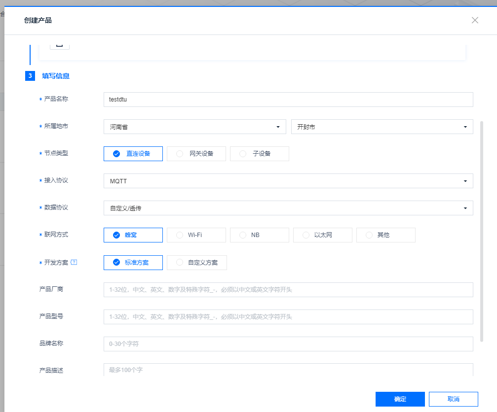

# **新版onenet**

最新版onenet需要项目的**ProductId**，**ProductSecret**还有设备的**ID**（默认为设备的IMEI，也就是**DeviceName**）

### **创建一型一密的项目**

新建产品如下所示即可

新建设备

 点击左侧产品开发选择产品可获得产品的产品ID和access_key，因为onenet的生成三元组的方式想需要产品级/设备级的秘钥，类似于阿里云一型一密和一机一密的区别，dtu配置的话大多数是产品级别，所以我们这边获取这两个值。
 
 主题的获取方法在上面页面中，点击设备开发，topic管理，即可获取topic，在web配置的页面输入正确的topic才可以连接成功，否则会连接失败
 

## **iRTU web端配置**

基本参数的配置和网络通道参数中个参数的含义与解释在前面的章节中有详细的说明，在这里不做过多讲解，用户根据自己情况进行选择即可。
onenet最为重要的两个参数**ProductID**和**ProductSecret**前面讲过怎么获取了，将这两个参数填入对应位置即可。需要注意的是主题需要填写正确

单击确定，即可完成所有配置。

接下来给模块上电/重启，在设备上电情况下也可以通过串口/其他服务器端给模块发送rrpc,upconfig命令（串口端还可以发送+++命令），让设备读取到最新的参数配置即可。

当模块检测到参数配置有更新的情况下，会去跟新自己的参数，然后重启设备。重启之后就会去链接onenet，如果这时你的设备开启了日志打印且设备直连电脑，luatools打开且日志输出正常的情况下，会观察到luatools打印了下面两张截图的红框部分，如果都打印了，即证明你的设备连接onenet成功。

当然，你也可以在自己的onenet平台的项目列表里看见你的在线设备。

至此，onenet注册全过程完成，后续根据onenet规定的格式发送数据即可。
