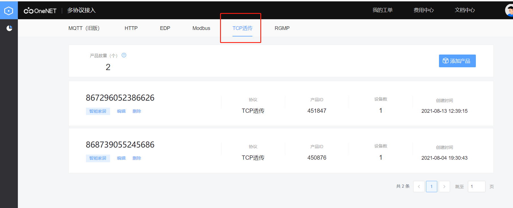

# 4. oneNET-DTU协议 透传

由于新版oneNET stdio改动较大，oneNET stdio还在适配中，所以本文先接入的是旧版oneNET平台，新版平台在适配中很快就能与大家见面了。
首先注册一个oneNET平台账号，注册过程可按[这里的](https://open.iot.10086.cn/passport/reg?appid=1)提示步骤完成。
注册成功后，访问如下图所示的[oneNET控制台]((https://open.iot.10086.cn/console/)).

由于我们需要使用的是旧版平台，所以在这里特别提示，需要用户点击的是如图所示的地方。

切换到旧版以后，需要用户点击左上角，**全部产品--多协议接入**

DTU协议透传，本质上其实还是TCP透传，所以我们进入多协议接入界面后，选择TCP协议。

点击**添加产品**后，**产品名称、产品行业、产品类别**根据用户实际需求自行选择，本文为了演示方便，默认用模块imei号为产品名称，产品行业和产品类别选择了默认的第一个。

**联网方式**选择为移动蜂窝网络，**接入协议**默认选择TCP透传。
**操作系统**选择“无”，**网络运营商**根据用户实际选择的运营商为准。

添加完产品以后，先不用着急添加设备，返回产品列表，有一个**产品ID**，记录下来后面会用到。

然后点击**设备列表**，记录下**设备注册码**后面也会用到，

点击**上传解析脚本**，上传test脚本（名字可以由用户自定义，自定义后需要记录脚本名称后面也会用到），如果没有，可以[点击这里](img/sample-save-str.lua)下载解析脚本文件。

上传完成后，oneNET平台的准备工作就完成了，接下来访问[合宙的dtu平台](https://dtu.openluat.com/)

选择**网络通道参数--通道类型(oneNET)--协议(DTU协议)**

心跳包用户可自定义，默认为0x00,链接保活时间默认300S，oneNET的地址或域名、服务器端口号不变，跟着默认值来就好，这里是为了防止oneNET换地址导致模块连不上平台设计的。
**正式生产环境注册码**：即是**设备注册码**

**产品ID**：为oneNET平台里**产品**的产品ID

**解析脚本名称**：用户可自定义，但必须与oneNET平台定义的脚本名称相同。

单击确定，即可完成所有配置。

接下来给模块上电/重启，在设备上电情况下也可以通过串口/其他服务器端给模块发送rrpc,upconfig命令（串口端还可以发送+++命令），让设备读取到最新的参数配置即可。

当模块检测到参数配置有更新的情况下，会去跟新自己的参数，然后重启设备。重启之后就会去链接oneNET，如果这时你的设备开启了日志打印且设备直连电脑，luatools打开且日志输出正常的情况下，会观察到luatools打印了下面两张截图的红框部分，如果都打印了，即证明你的设备连接oneNET成功。

* 日志打印:
[---------------------- 网络注册已成功 ----------------------]
-[----------------------- OneNET is start! --------------------------------------]

* 截图:

oneNET_TCP_设备参数配置:

设备上线显示：

数据上传：

* 注意事项: 根据用户实际开发需要，自行编写脚本文件（在上传的解析脚本里编写），来实现数据流上传与下发的处理方式，示例脚本中些的是每隔10S给平台发送一次hello。
