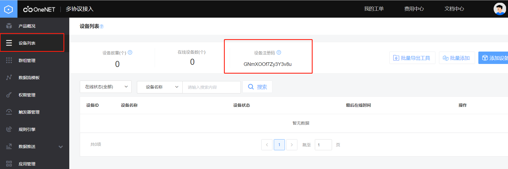
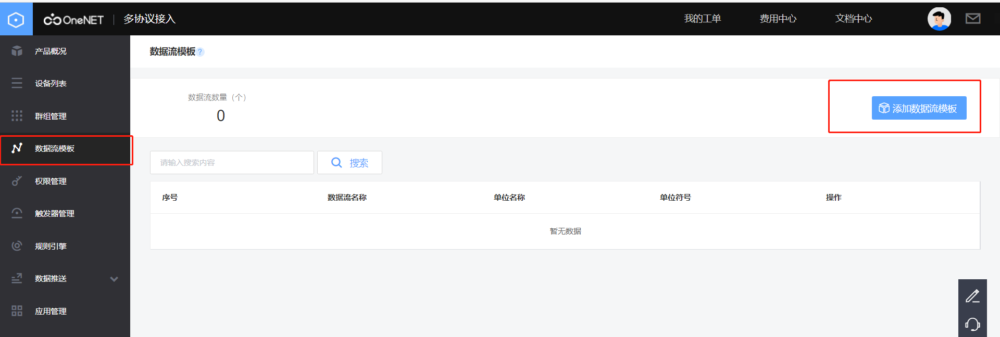
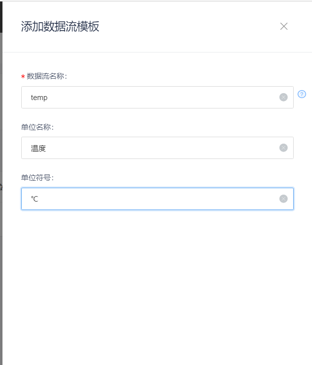
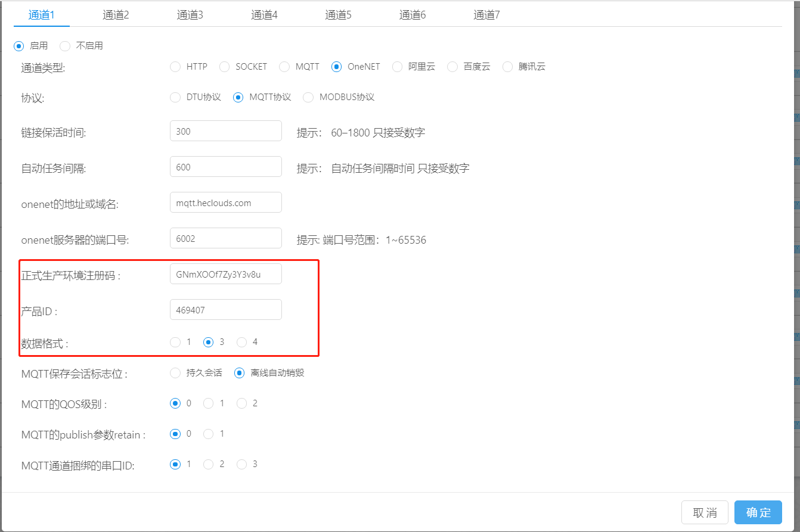
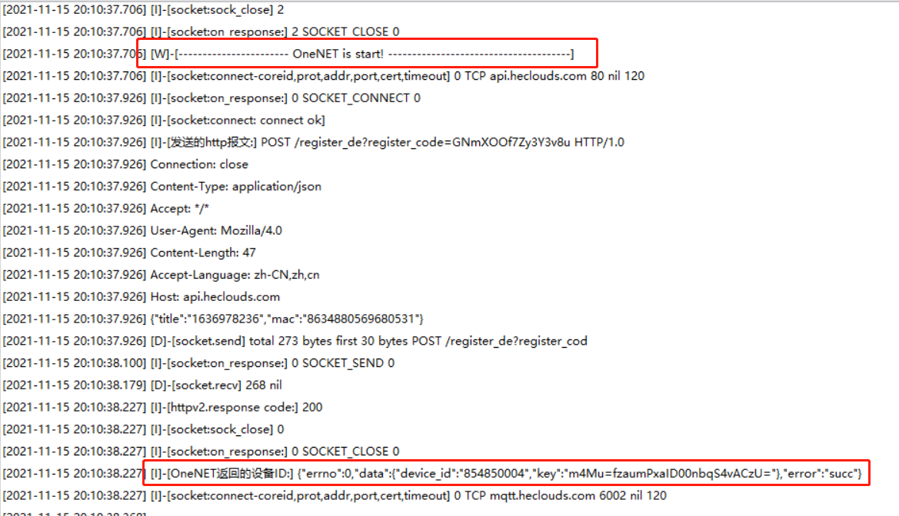
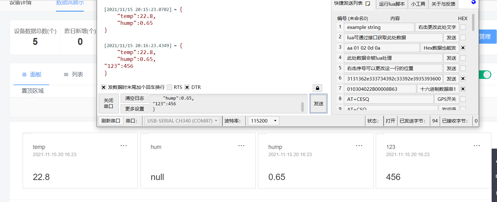

# 5. oneNET-MQTT协议 透传

* 操作步骤：

1.注册和打开旧版oneNET以及控制台在前文oneNET-DTU协议中已经写的很详细了，在这里不做过多阐述，有需要的可以参考oneNET-DTU协议一文中最前面的部分。

2.点击oneNET平台上的MQTT(旧版)，然后点击添加产品。

点击**添加产品**后，**产品名称、产品行业、产品类别**根据用户实际需求自行选择，本文为了演示方便，用DTU_MQTT为产品名称，产品行业和产品类别选择了默认的第一个。

**联网方式**选择为移动蜂窝网络，**接入协议**默认选择MQTT(旧版)。

**操作系统**选择“无”，**网络运营商**根据用户实际选择的运营商为准。

添加完产品以后，先不用着急添加设备，返回产品列表，有一个**产品ID**，记录下来后面会用到。

然后点击**设备列表**，记录下**设备注册码**后面也会用到

单击数据流模板，添加对应的数据流模板（数据流模板可按用户实际项目需求自行填写，在这里为了演示方便，我选择了温度和湿度作为数据流模板）

温度和湿度同理，在这里不做过多阐述

设置完成后，oneNET平台的准备工作就完成了，接下来开始dtu管理平台的设置。

登录[DTU管理平台](https://dtu.openluat.com/)

**网络通道参数--oneNET--MQTT协议**

心跳包用户可自定义，默认为0x00,链接保活时间默认300S，oneNET的地址或域名、服务器端口号不变，跟着默认值来就好，这里是为了防止oneNET换地址导致模块连不上平台设计的。

**正式生产环境注册码**：即是**设备注册码**

**产品ID**：为oneNET平台里**产品**的产品ID

**数据格式**选**3**（json格式），通过串口发送数据时也要封装成json格式的数据。

关于**数据格式**134的区别可以看下面的解释

| 参数 | 描述                | 备注 |
| ---- | ------------------- | ---- |
| 1    | onenet数据上报格式1 | JSON格式1字符串，默认为该格式    |
| 3    | onenet数据上报格式3 | JSON格式2字符串    |
| 4    | onenet数据上报格式4 | JSON格式3字符串   |

关于该参数的**详细参考**可以参考[文档与工具_开发者文档_OneNET (10086.cn)](https://open.iot.10086.cn/doc/multiprotocol/book/develop/mqtt/device/doc-tool.html)（《设备终端接入协议-MQTT》一文中，5.2.1 数据点上报）

单击确定，即可完成所有配置。

接下来给模块上电/重启，在设备上电情况下也可以通过串口/其他服务器端给模块发送rrpc,upconfig命令（串口端还可以发送+++命令），让设备读取到最新的参数配置即可。

当模块检测到参数配置有更新的情况下，会去跟新自己的参数，然后重启设备。重启之后就会去链接oneNET，如果这时你的设备开启了日志打印且设备直连电脑，luatools打开且日志输出正常的情况下，会观察到luatools打印了下面两张截图的红框部分，如果都打印了，即证明你的设备连接oneNET成功。
* 日志打印：-[---------------------- 网络注册已成功 ----------------------]
-[----------------------- OneNET is start! --------------------------------------]

* 截图：

* 注意事项:如未创建数据流模板，将对应格式json文件上传到oneNET平台后，平台会自动生成一个数据流模板。