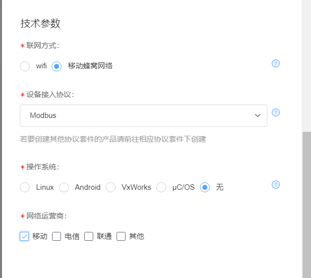
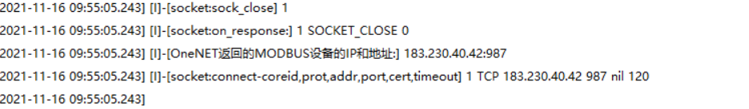
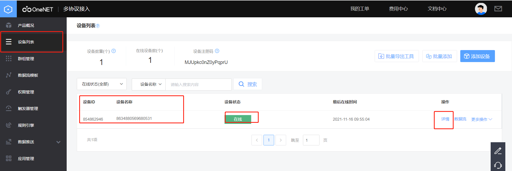
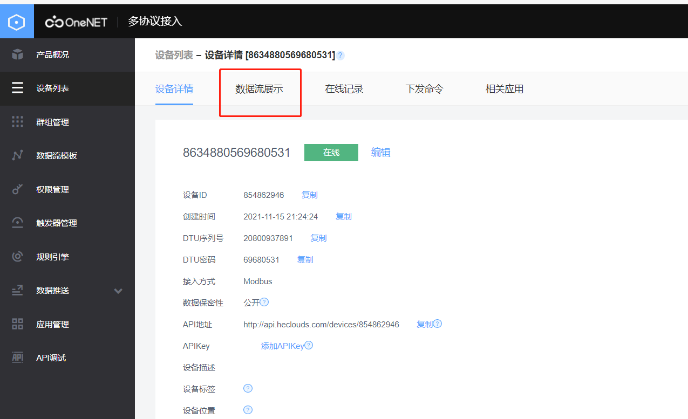
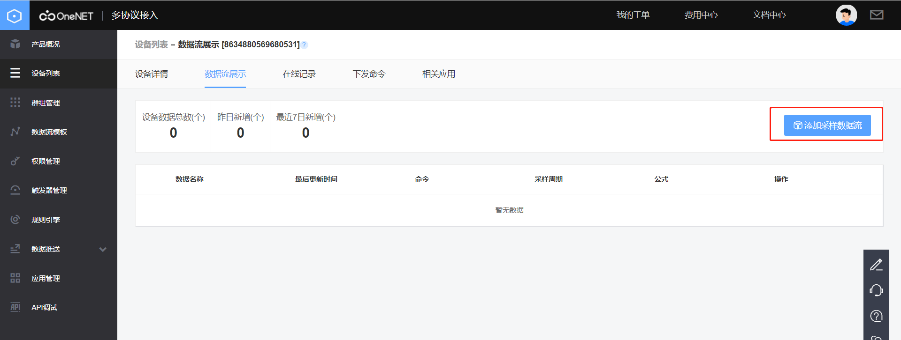
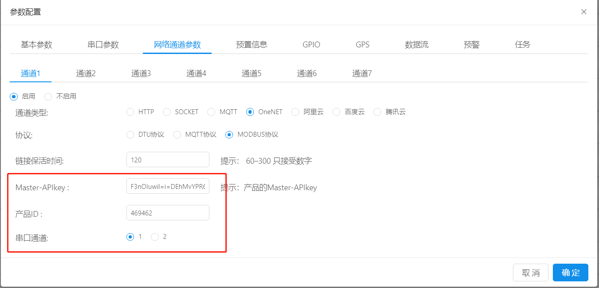
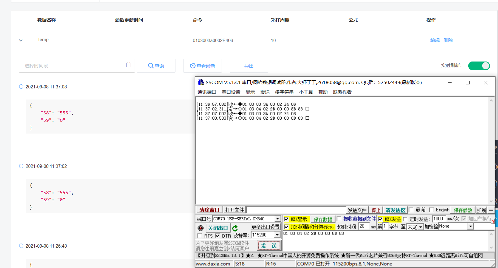

# oneNET-MODBUS协议 透传

* 操作步骤：

1.注册和打开旧版oneNET以及控制台在前文oneNET-DTU协议中已经写的很详细了，在这里不做过多阐述，有需要的可以参考oneNET-DTU协议一文中最前面的部分。

2.点击oneNET平台上的**modbus**，然后点击添加产品。

点击**添加产品**后，**产品名称、产品行业、产品类别**根据用户实际需求自行选择，本文为了演示方便，用DTU_MQTT为产品名称，产品行业和产品类别选择了默认的第一个。

**联网方式**选择为移动蜂窝网络，**接入协议**默认选择**MODBUS**。

**操作系统**选择“无”，**网络运营商**根据用户实际选择的运营商为准。

添加完产品以后，先不用着急添加设备，返回产品列表，有一个**产品ID**，记录下来后面会用到。

然后点击查看**Master-APIkey**，记录下**Master-APIkey**后面也会用到.

到这步，oneNET平台的配置，已经基本结束，接下来是web平台的配置，访问[合宙的dtu平台](https://dtu.openluat.com/)选择**网络通道参数--通道类型(oneNET)--MODBUS(MODBUS协议)**

**链接保活时间**:此项设置为和oneNET平台进行心跳的间隔时间，默认为120秒，不建议设置过快，过快会影响正常数据交互。

**Master-APIkey**：即是上文中在oneNET平台上记录的Master-APIkey。

**产品ID**：为oneNET平台里**产品**的产品ID

单击确定，即可完成所有配置。

接下来给模块上电/重启，在设备上电情况下也可以通过串口/其他服务器端给模块发送rrpc,upconfig命令（串口端还可以发送+++命令），让设备读取到最新的参数配置即可。

当模块检测到参数配置有更新的情况下，会去跟新自己的参数，然后重启设备。重启之后就会去链接oneNET，如果这时你的设备开启了日志打印且设备直连电脑，luatools打开且日志输出正常的情况下，会观察到luatools打印了下面截图的红框部分，即证明你的设备连接oneNET成功，当然在oneNET平台**设备列表**上也可以看到刚刚注册上线的设备。

接下来需要完成的数据交互，既然选择的是modbus协议，就需要在oneNET平台上添加采样数据流，
还是点击**设备列表**，在线设备里，右侧有个**详情**与**数据流**，点击详情，进入设备详情界面，然后再点击**数据流展示**。

3. 添加采样数据流：包括从机地址、功能号、数据地址和数据长度。从而能解析到从模块上传的数据。如01 03 003a 0002，串口工具调整到匹配的波特率勾选HEX发送，然后发送01 03 04 02 2B 00 00 8B 83，会在OneNet上显示解析后的数据。
    **从机地址**、**功能号**、***数据地址**、**数据长度**、**数据周期**根据客户实际需求自行选择，本文只做一个示范。

* 日志打印：
-[---------------------- 网络注册已成功 ----------------------]
-[----------------------- OneNET is start! --------------------------------------]
-[OneNET返回的MODBUS设备的IP和地址:] 183.230.40.42:987

* 截图：

* 注意事项：添加采样数据流后，在串口发送数据时要对应从机地址和功能号。
