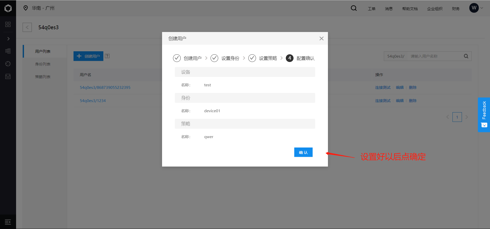

# 百度云-数据型透传

## 操作步骤

首先创建项目（老版百度云需要找百度云机器人客服激活）

进入项目设置策略

打开dtu平台，进行设置

重启模块，打开luatools打印日志

创建一个新用户用于测试数据收发

## 百度云-设备型透传

### 操作步骤

首先创建项目（老版百度云需要找百度云机器人客服激活，注意：设备型只能创建一个项目，创建时先确认好名称等）

设置好参数后重启模块

