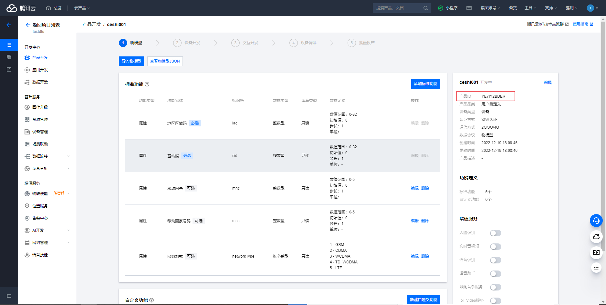

# **腾讯云（新版）自动注册**

## **腾讯云端的配置**

自动注册设备需要用到三个很重要的参数**DeviceName**、**ProductID**和**ProductSecret**。

### 腾讯云**ProductKey**的产生

#### **1.进入腾讯云物联网开发平台**

登录进腾讯云web端后，单击控制台

进入控制台后，在**搜索栏**中搜索物联网平台，点击进入即可

进入平台后点击**实例管理**

#### **2.公共实例与企业实例的选择**

关于公共版实例与企业版实例的区别可以点击[这里查看](https://cloud.tencent.com/document/product/1081)，
这里为了演示方便，我们选择了公共版实例

#### **3.创建项目**

进入公共版实例以后点击**项目列表**--->**创建项目**，默认无项目，截图中的几个项目是我自己创建的

**项目名称**用户自定义即可
**项目描述**用户自定义即可

#### **3.创建产品**

进入项目以后点击**产品开发**--->**创建产品**，默认无产品，截图中的几个产品是我自己创建的

**产品名称**用户自定义即可
**产品品类**根据用户使用场景自由选择，方便演示这里选择第二个

**设备类型**选择**设备**。
**通信方式**这里，因为我们使用的是Cat.1/2G模块，所以要选择**2G/3G/4G**。
**认证方式**这里，由于本文主要讲的是**自动注册**，所以选择**密钥认证**。
**数据协议**这里，可以选择**物模型**和**自定义透传**。
物模型协议是腾讯云物联网开发平台定义的物模型协议，基于JSON格式可方便的进行设备向云端进行数据传输，并在云端进行存储与处理。
自定义透传协议是基于MQTT协议将用户私有业务数据上云。
**描述**用户自定义即可
点击**确定**后即可创建自己的产品。

创建成功后，因为本章讲解的主要是自动注册功能，直接点击**设备名称**即可。

#### **4.查询productID**

在项目名下即可看到自动注册最为重要的一个ID---**ProductID**
将productID复制出来备用。

#### **4.查询ProductSecret**

在项目名下即可看到自动注册的**ProductSecret**
点击动态注册将出现ProductSecret，点击显示可以查看ProductSecret。
点击自动创建设备可以根据**DeviceName**自动创建设备，自动创建设备如果不填**DeviceName**会默认IEMI作为设备名称创建设备，不点击则要在设备管理里面创建设备。

#### **4.创建设备**

如果没有选择自动创建设备，则需要在设备管理里面创建设备，一般用设备IMEI作为设备名称。

至此，腾讯云平台配置工作完成，接下来做iRTU的web端配置

## **iRTU web端配置**

基本参数的配置和网络通道参数中个参数的含义与解释在前面的章节中有详细的说明，在这里不做过多讲解，用户根据自己情况进行选择即可。
自动注册到腾讯云最为重要的三个参数，**DeviceName、ProductID、ProductSecret**前面讲过怎么获取了，将这三个参数填入对应位置即可，如果选择了自动创建设备可以不填，默认模块的IMEI号为设备名称。

单击确定，即可完成所有配置。

接下来给模块上电/重启，在设备上电情况下也可以通过串口/其他服务器端给模块发送rrpc,upconfig命令（串口端还可以发送+++命令），让设备读取到最新的参数配置即可。

当模块检测到参数配置有更新的情况下，会去跟新自己的参数，然后重启设备。重启之后就会去链接腾讯云，如果这时你的设备开启了日志打印且设备直连电脑，luatools打开且日志输出正常的情况下，会观察到luatools打印了下面两张截图的红框部分，如果都打印了，即证明你的设备连接腾讯云成功。

当然，你也可以在自己的腾讯云平台的项目列表里看见你的在线设备。

至此，腾讯云自动注册全过程完成。
