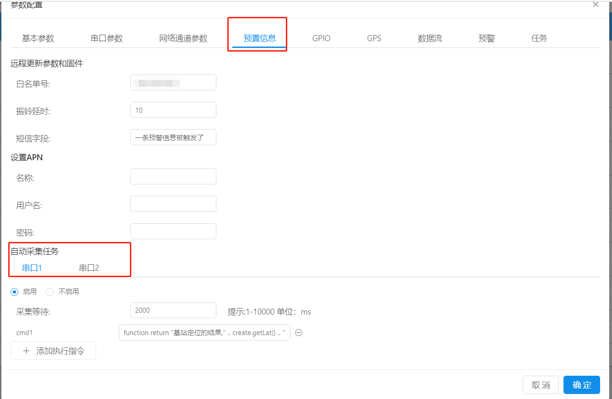
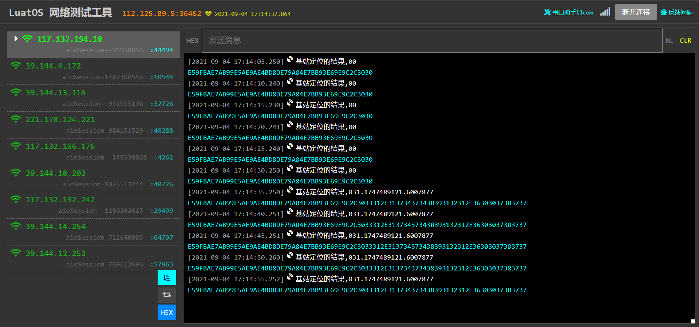

# **自动任务采集**

## **web端配置**

自动任务采集：当用户觉得iRTU现有的功能不能满足要求，想获取模块的各种信息，例如基站定位的结果，获取ADC的电压值，获取模块SN/IMEI号，获取GSM网络注册状态等，就可以在自动采集任务中去实现。下面简单介绍下自动采集任务如何操作。

打开**预置信息**-->**自动采集任务**-->串口1/串口2(根据用户实际情况进行选择)，勾选**启用选项**。

**采集等待**：部分信息（例如基站定位结果）是需要延时等待才会有结果的（例如基站定位需要模块去和基站进行通讯，获取到基站返回的原始数据后，并不能直接解析，需要把数据发送给解析服务器，服务器解析好了以后，再把解析后的数据返回给模块），所以需要设置采集等待时间。

**CMD**：此项即是**自动采集**需要发送的命令了，命令格式如下

```lua
--"用户自定义字符串"和用户想要执行的函数中间必须要加“ .. ”，这种写法在lua中表示将前后的字符或变量拼接起来
    function  return "用户自定义字符串"..用户想要执行的函数 end
```

- 提示：
  - 函数需要用function 开头，用end结尾,用来区别HEX指令。用串口写入该配置参数的时候，注意函数中的分号要转义处理。
  - 函数结尾return返回的数据会被发往用户配置的服务器，用户可以自定义通信报文协议。
  - 如果函数需要写入数据到串口，直接调在函数调用“uart.write(uid,str)” 类似的Luat-API。

例如

```lua
function return "基站定位的结果,"..create.getLat()..create.getLng() end
```





以上演示仅是**自动采集任务**的实例demo，用户可根据自己的实际需要去写自己的**自动采集任务**
