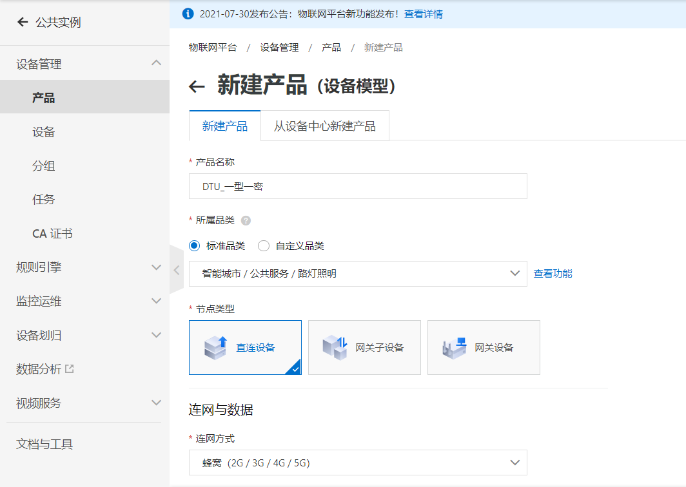
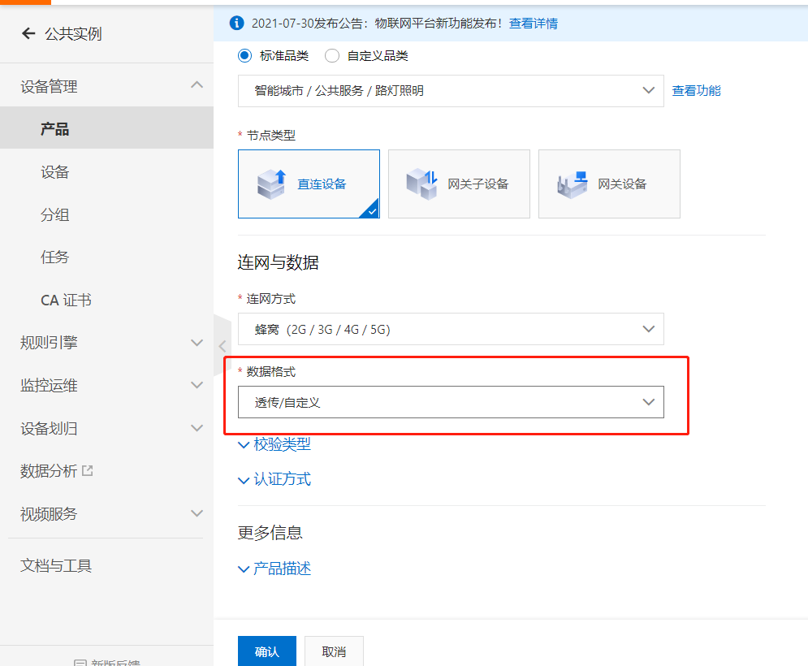
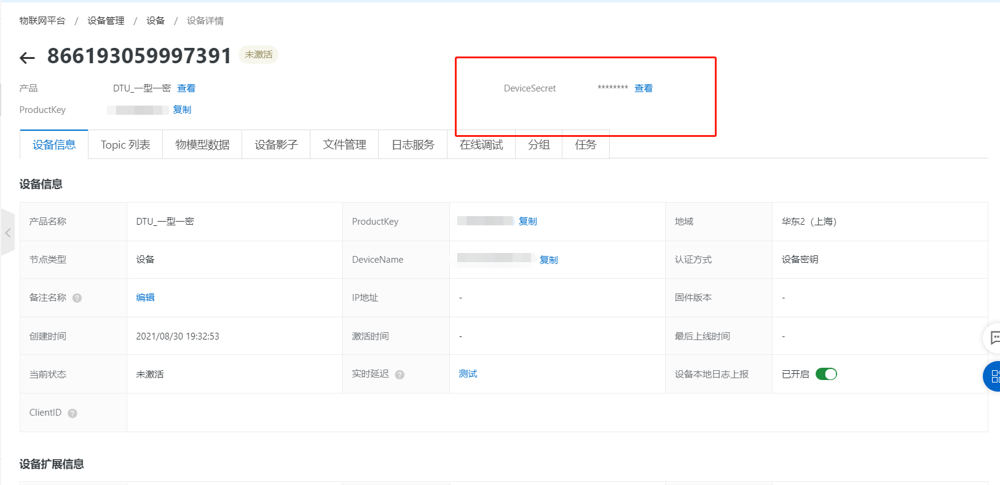
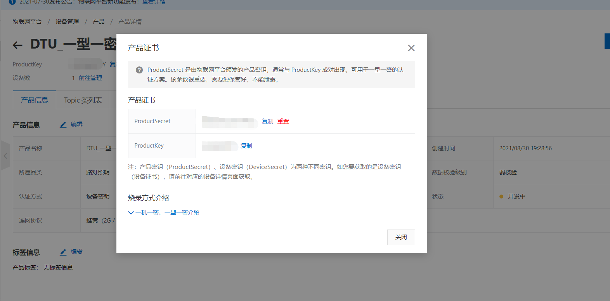
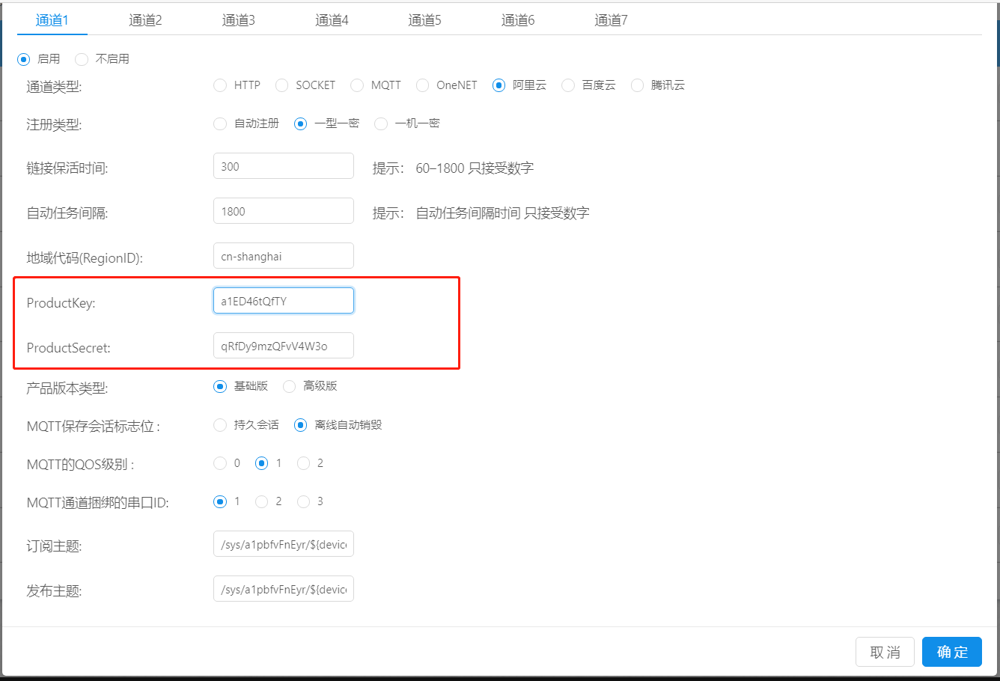
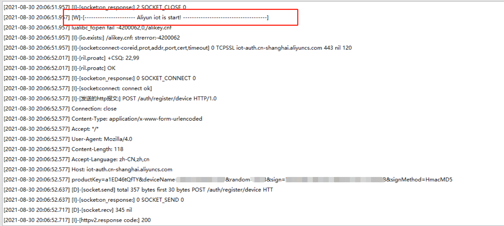
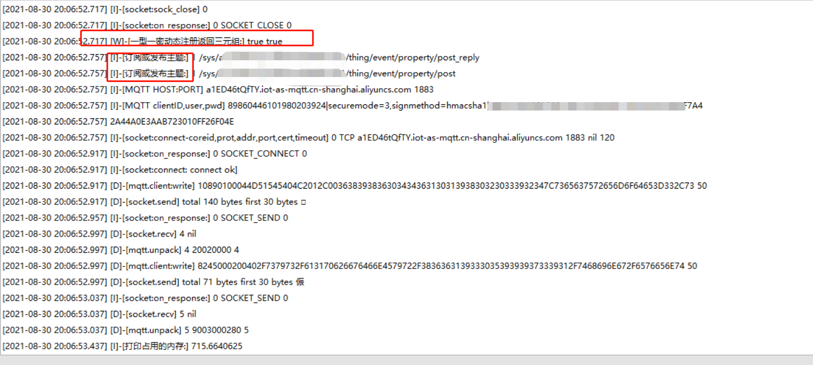
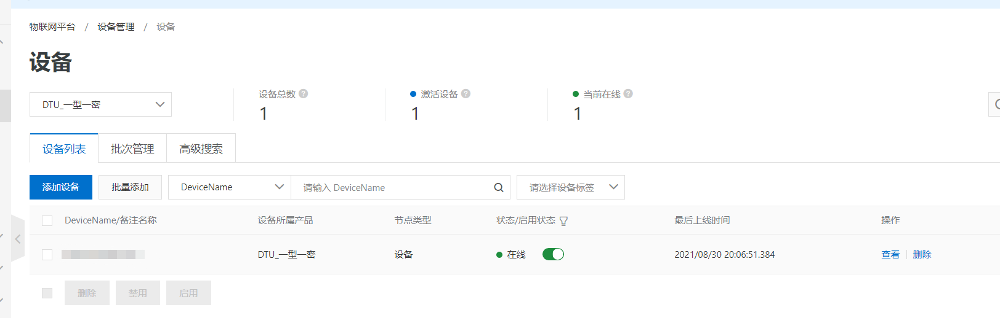

# **阿里云一机一密注册**

阿里云一机一密与一型一密注册过程相似
区别是一机一密需要项目的**ProductKey**，**DeviceSecret**还有设备的**ID**（默认为设备的IMEI，也就是**DeviceName**），而一型一密不需要设备的**DeviceName**
一型一密需要打开**自动注册**
其他过程完全一致,本文介绍阿里云的一型一密注册过程。

## **阿里云界面配置过程**

关于如何打开控制台，如何进入阿里云物联网平台，如何新建产品，在“阿里云自动注册”一文中有详细的描述在这里不做过多赘述。注：本文为了演示方便，演示过程均为为公共实例的注册。

### **创建一型一密的项目**

新建产品如下所示即可（注：所属品类根据用户实际需求进行选择，本文为了掩饰方便，选择了默认的第一个）

注意这里的数据格式，选择透传和Alink_JSON都可以，用户根据实际需求进行选择，如果需要使用到物模型功能，勾选Alink_JSON，如果只是透传数据则勾选透传即可。

 由于一机一密和一型一密没有自动注册这个功能，所以我们需要在创建好的产品下手动添加设备。（注：一定要打开**动态注册**选项）
 
 设备名建议用IMEI号来命名，方便用户识别。(注：虽然合宙提供了修改IMEI的方法，但是仅作为调试使用，不建议用户量产使用，会影响到后期的空中升级，并违反相关法律法规)
 添加完设备后回到**产品**，点击你的**一型一密产品**，进入产品界面,点击红框内的**查看**。

将自己**ProductSecret**和**ProductKey**保存起来，后面iRTU的web端配置需要。

一型一密最为重要的两个个参数，**ProductSecret**和**ProductKey**到这里就获取完成了，接下来做iRTU的web端配置。

## **iRTU web端配置**

基本参数的配置和网络通道参数中个参数的含义与解释在前面的章节中有详细的说明，在这里不做过多讲解，用户根据自己情况进行选择即可。
阿里云一型一密最为重要的两个参数**ProductSecret**和**ProductKey**前面讲过怎么获取了，将这两个参数填入对应位置即可。

单击确定，即可完成所有配置。

接下来给模块上电/重启，在设备上电情况下也可以通过串口/其他服务器端给模块发送rrpc,upconfig命令（串口端还可以发送+++命令），让设备读取到最新的参数配置即可。

当模块检测到参数配置有更新的情况下，会去跟新自己的参数，然后重启设备。重启之后就会去链接阿里云，如果这时你的设备开启了日志打印且设备直连电脑，luatools打开且日志输出正常的情况下，会观察到luatools打印了下面两张截图的红框部分，如果都打印了，即证明你的设备连接阿里云成功。

当然，你也可以在自己的阿里云平台的项目列表里看见你的在线设备。

至此，阿里云一型一密注册全过程完成，Alink_JSON格式发送物模型数据会在下面的章节里讲到。
