# **阿里云的自动注册**

## **阿里云端的配置**

### **RAM平台子用户的创建与权限**

先从RAM平台子用户的创建与权限分配说起。

因为自动注册设备需要用到两个阿里云很重要的参数**AccessKey ID**和**Access Key Secret**，而这两个参数在阿里云中的地位可不一般，他几乎可以对你一切产品进行操作，所以阿里云推出了RAM（Resource Access Management）管理平台，RAM 的主要作用是控制账号系统的权限。通过使用 RAM，创建、管理子账号，并通过给子账号授予不同的权限，控制子账号对资源的操作权限，今天用到的就是这个。

#### **1.开通**

直接[点这里](https://account.aliyun.com/login/login.htm?oauth_callback=http%3A%2F%2Fbuy.aliyun.com%2Fram%3Fspm%3Da2c4g.11186623.2.11.123a49930kpP5m)就可以开通，前提是你要有阿里云账号(此处注册[阿里云平台](https://account.aliyun.com/register/register.htm?spm=a212t0.3047821.0.0.7d321b05JTzrOq&oauth_callback=https%3A%2F%2Faccount.console.aliyun.com%2Fv2%2F))

#### **2.新建用户**

开通界面如下图所示（默认没有用户那5个是我加的），点右侧**用户**--->新建用户

起个名，随便写，下面**Open API** 调用访问一定勾选，后面说了启用**AccessKeyID和AccessKeySecret**，支持通过API或其他开发工具访问，要的就是这个

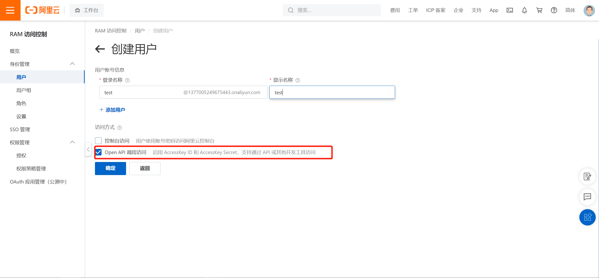

#### **3.保存参数**

保存好这几个参数备用，建议直接下载，这个只能查看一次忘了只能重置

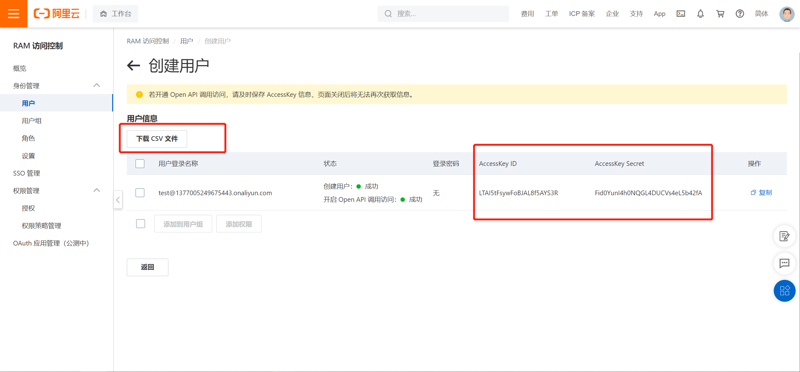

#### **4.新增授权**

新增一个**授权权限策略**,授权--->授权主体（输入你刚刚创建的用户名）--->新建权限策略

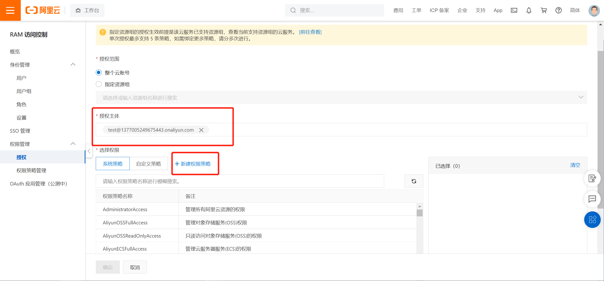

#### **5.配置策略**

名称随意，点击**脚本配置**

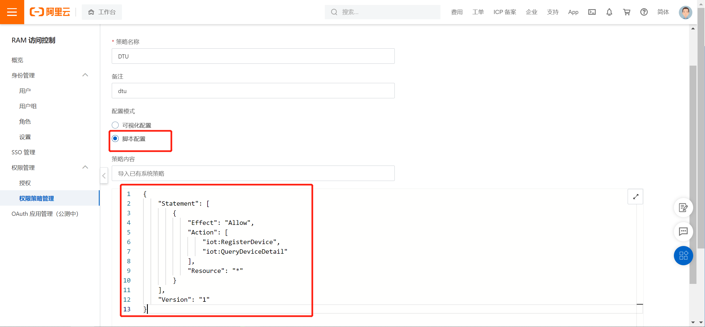

具体脚本如下

    {
    "Statement": [
        {
            "Effect": "Allow",
            "Action": [
                "iot:RegisterDevice",
                "iot:QueryDeviceDetail"
            ],
            "Resource": "*"
        }
    ],
    "Version": "1"
    }

如何编写这个脚本可以[看这里](https://help.aliyun.com/document_detail/47495.html?spm=a2c4g.11186623.2.16.634625e3QP19FR)

这个脚本iot:RegisterDevice是注册设备，iot:QueryDeviceDetail是查询设备详情，iRTU只用了这两个权限。

#### **6.添加权限**

回到刚才创建的用户为他添加权限

选自定义，点击该策略即可添加至列表，然后点击确定即可

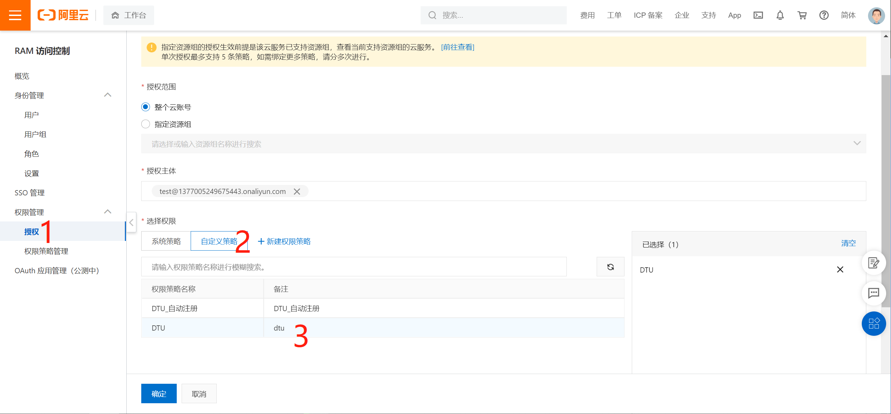

### 阿里云**ProductKey**的产生

#### **1.进入阿里云物联网平台**

登录进阿里云web端后，单击控制台

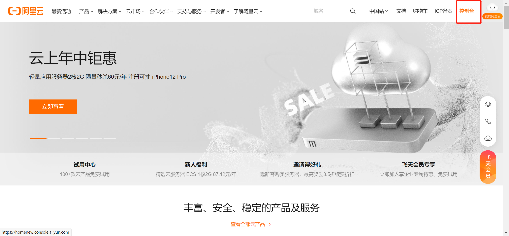

进入控制台后，在**全部产品与服务**中搜索物联网平台，点击进入即可
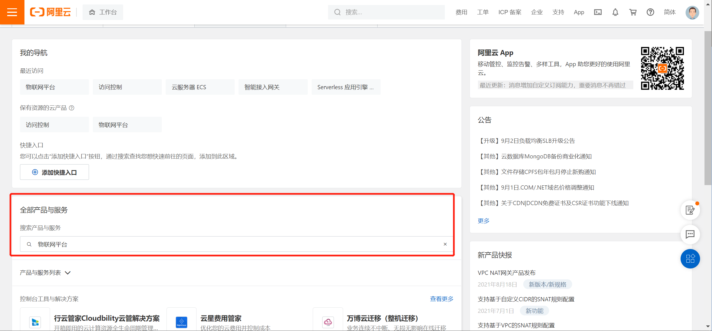
进入平台后点击**实例概览**

#### **2.公共实例与企业实例的选择**

关于公共版实例与企业版实例的区别可以点击[这里查看](https://help.aliyun.com/document_detail/147356.html)，
这里为了演示方便，我们选择了公共版实例
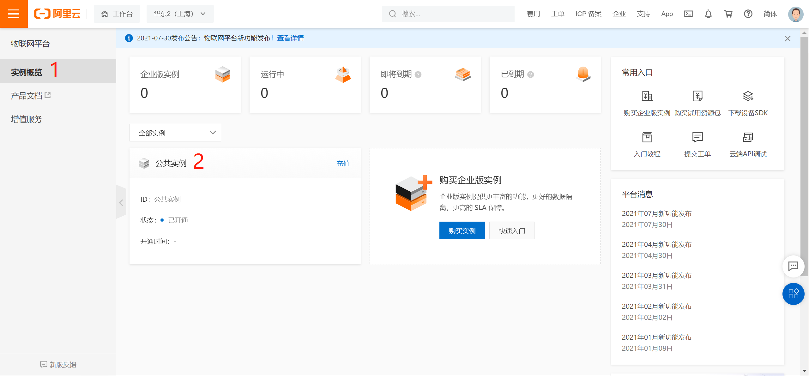

#### **3.创建产品**

进入公共版实例以后点击**产品**--->**创建产品**，默认无产品，截图中的几个产品是我自己创建的
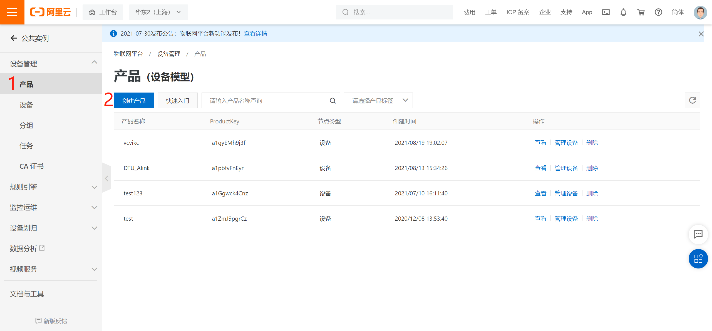
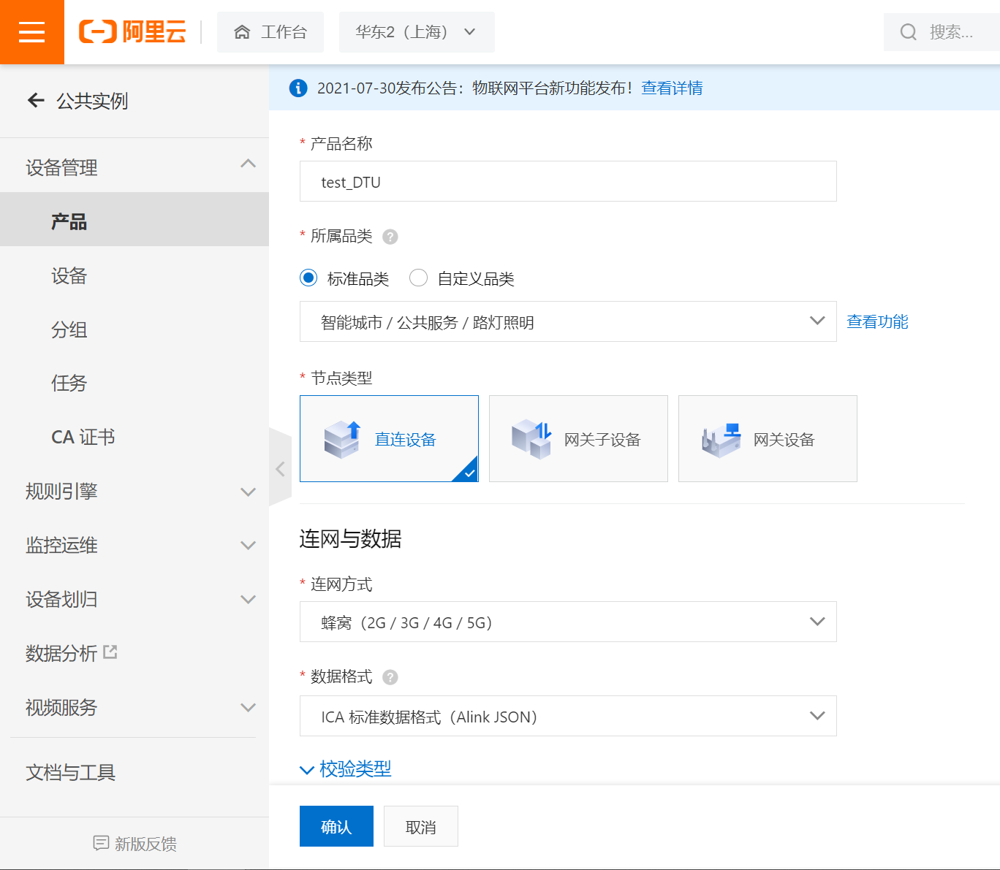
**产品名称**用户自定义即可
**所属品类**根据用户使用场景自由选择，方便演示这里选择第一个

**节点类型**选择**直连设备**，如下是三种设备的简介。

    直连设备：直连物联网平台，但不能挂载子设备的设备
    网关子设备：作为网关的子设备，由网关代理连接物联网平台。
    网关设备：可以挂载子设备的直连设备。网关可以管理子设备，维持与子设备的拓扑关系，并将该拓扑关系同步到云端。
**联网方式**这里，因为我们使用的是Cat.1/Cat.4/2G模块，所以要选择**蜂窝(2G/3G/4G/5G)**。
**数据格式**这里，由于本文主要讲的是**自动注册**，所以选择**透传**或者**Alink JSON**没有区别,如果要使用阿里云的物模型功能，需要勾选**Alink JSON**。
校验类型，验证方式，产品描述这三部分为选填，非必填项，客户根据实际需求选填即可。
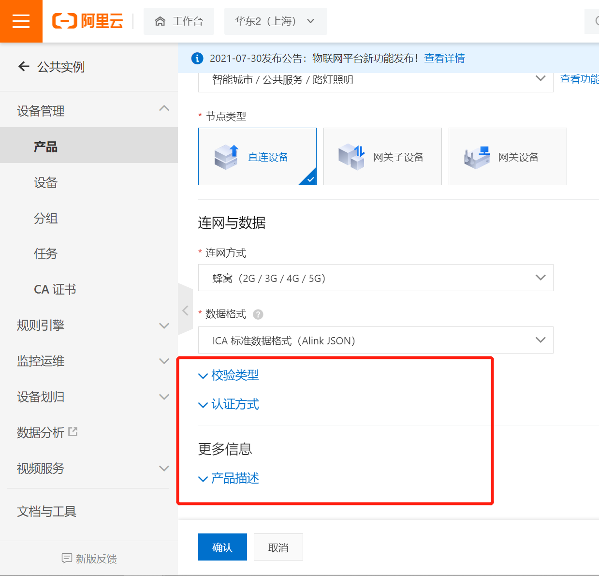
点击**确定**后即可创建自己的产品。
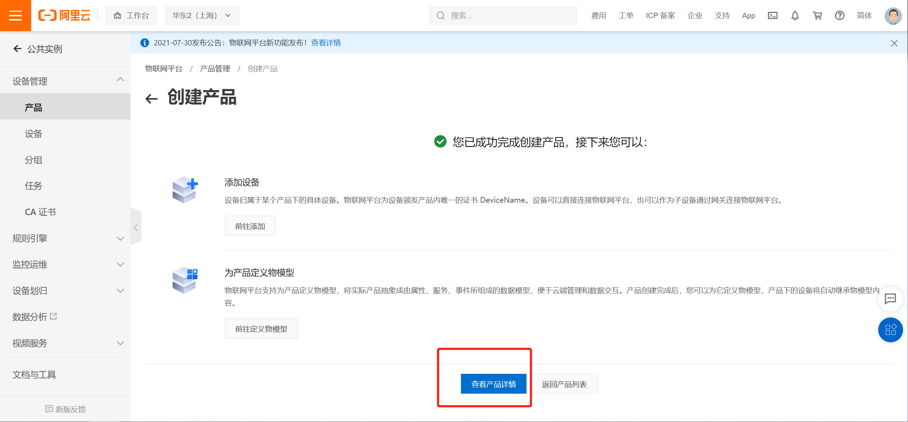
创建成功后，因为本章讲解的主要是自动注册功能，所以不用添加任何设备和物模型，直接点击**查看设备详情**即可。

#### **4.查询productkey**

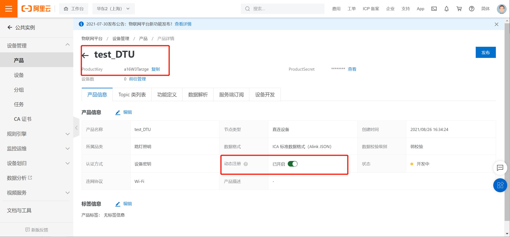
在项目名下即可看到自动注册最为重要的一个key---**ProductKey**
将productkey复制出来备用。

至此，阿里云平台配置工作完成，接下来做iRTU的web端配置

## **iRTU web端配置**

基本参数的配置和网络通道参数中个参数的含义与解释在前面的章节中有详细的说明，在这里不做过多讲解，用户根据自己情况进行选择即可。
自动注册到阿里云最为重要的三个参数，**ProductKey、AccessKey ID、Access Key Secret**前面讲过怎么获取了，将这三个参数填入对应位置即可。
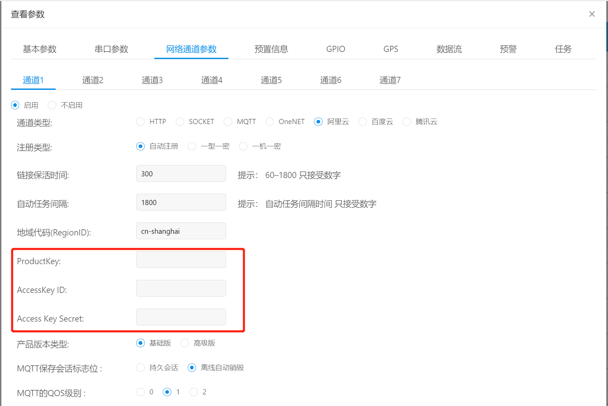

单击确定，即可完成所有配置。

接下来给模块上电/重启，在设备上电情况下也可以通过串口/其他服务器端给模块发送rrpc,upconfig命令（串口端还可以发送+++命令），让设备读取到最新的参数配置即可。

当模块检测到参数配置有更新的情况下，会去跟新自己的参数，然后重启设备。重启之后就会去链接阿里云，如果这时你的设备开启了日志打印且设备直连电脑，luatools打开且日志输出正常的情况下，会观察到luatools打印了下面两张截图的红框部分，如果都打印了，即证明你的设备连接阿里云成功。
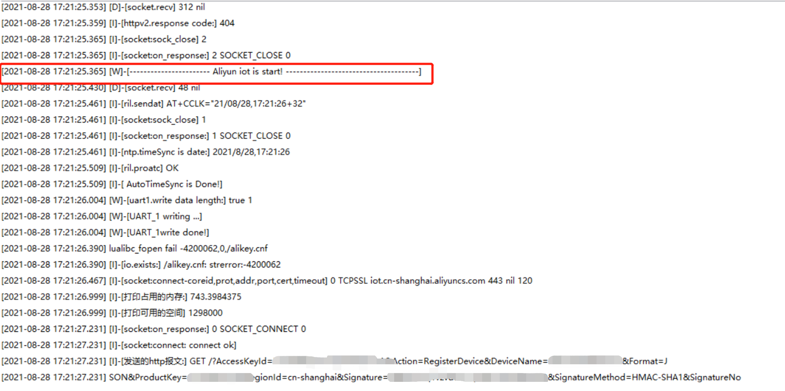
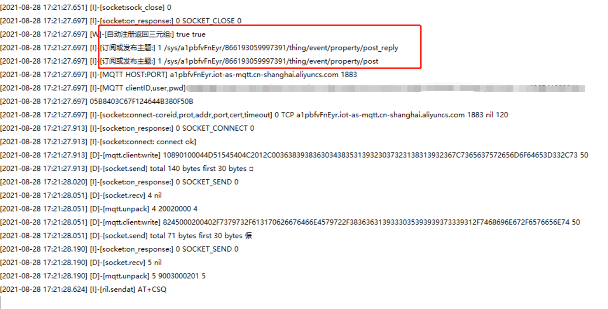
当然，你也可以在自己的阿里云平台的项目列表里看见你的在线设备。

至此，阿里云自动注册全过程完成，一机一密/一型一密/Alink_JSON格式发送物模型数据会在下面的章节里讲到。
