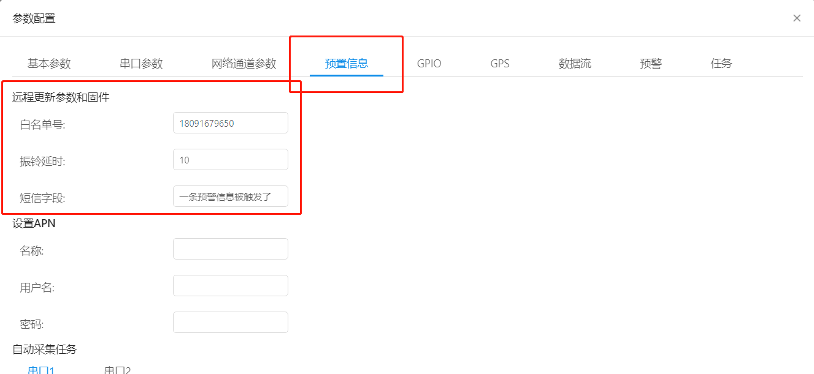
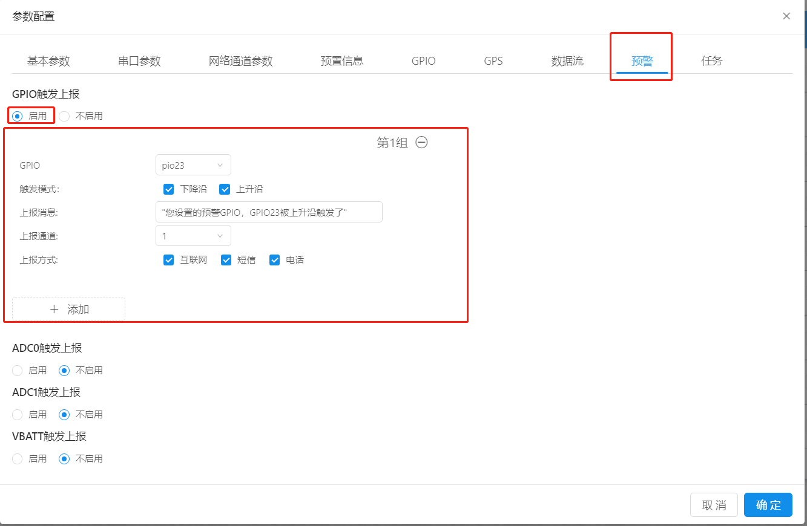
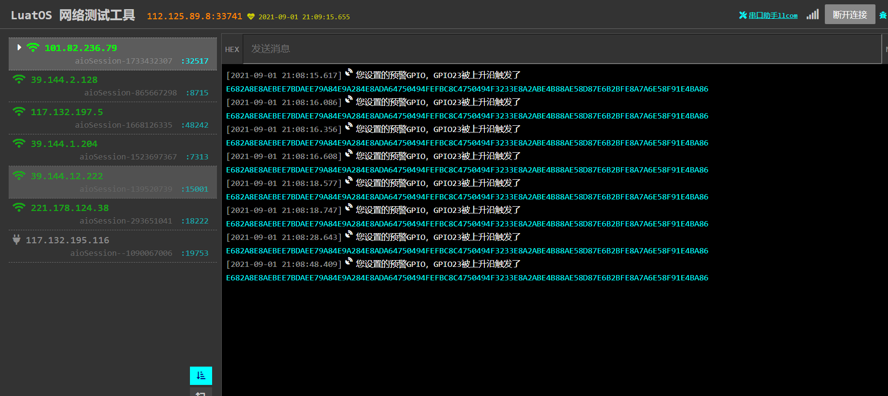
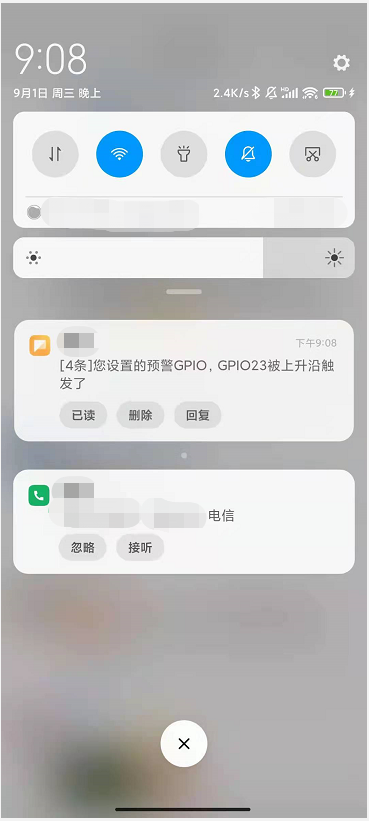
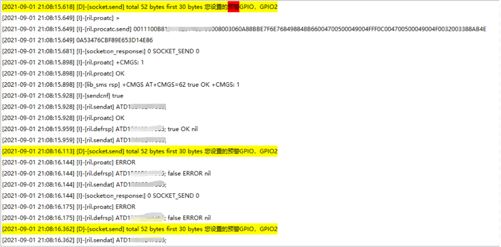
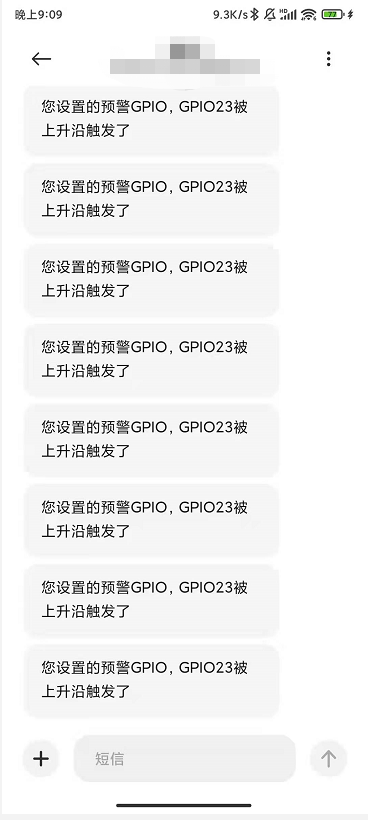
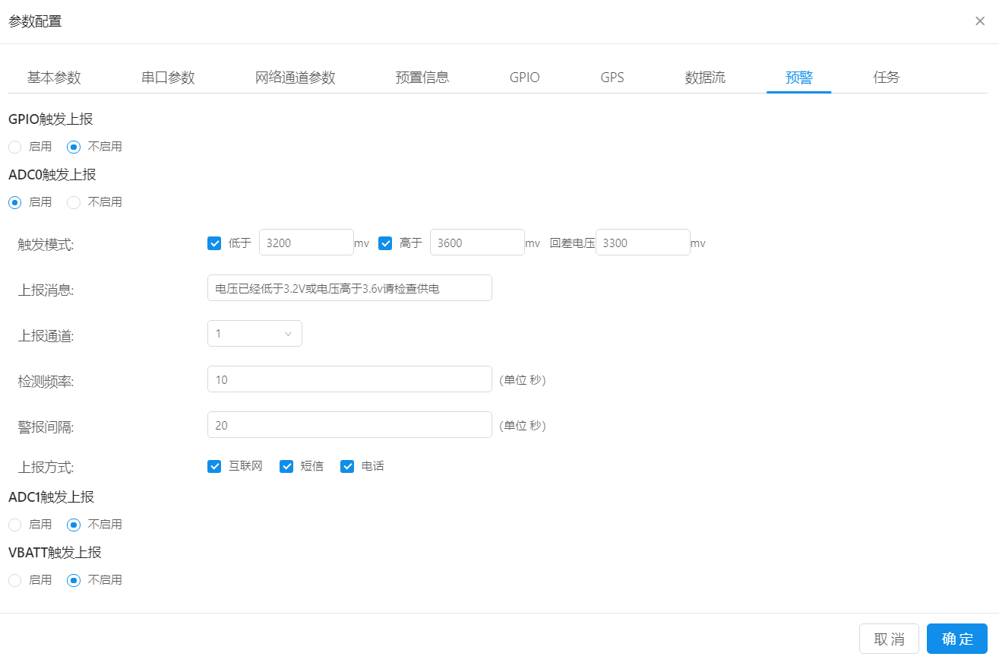
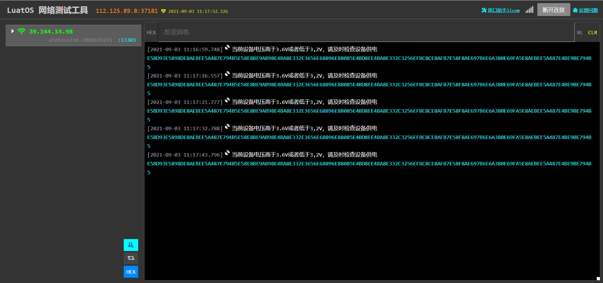
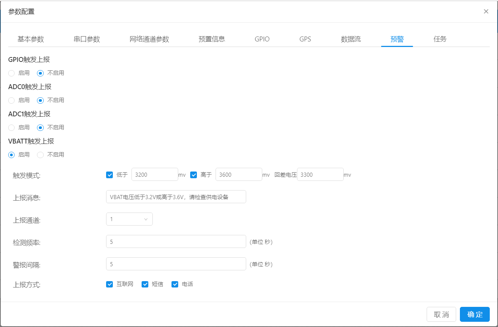

# **预警**

iRTU提供了GPIO/ADC/VBATT触发三种预警方式供用户选择，预警又可以发送到服务器(又称互联网88)/手机(短信/电话)，本文会详细的讲解这三种预警方式的使用方法，并提供教程。

本文提及的所有触发，为方便演示，链接的服务器都是[合宙测试服务器](https://netlab.luatos.com/)，用户根据当前项目实际需求，自行选择服务器发送预警信息。
关于电话和短信的预警信息提示，需要当前设备上插的卡为特殊物联网卡(可以打电话或者发短信)或者手机卡，如果任意用户设置过的预警方式被激活，都会发送对应的信息到**白名单客户**的卡上去。
白名单客户的设置在下图所示位置，**预警信息**---->**远程更新参数和固件**里，用户根据实际需求，自行设置即可。

## **GPIO触发**

### **web端配置**

GPIO触发需要在web端内配置如下图所示，点击**预警**，**GPIO触发上报**勾选启用，具体的GPIO号根据客户实际需求自行更改（需要去看对应模块以及自己设计的板子的原理图确定实际GPIO，这里演示的时候使用的是724 A13官方开发板）

**触发模式**也是根据用户实际需要进行选择，这里为了演示方便，上升与下降沿触发都勾选上了

**上报消息**可以根据用户服务器能接受并处理的消息自行添加与更改，默认为字符串格式。

**上报通道**本项必须根据和用户在**网络通道参数**中设置的通道ID一致，否则用户服务器收不到数据

**上报方式**上报方式有**互联网**(即用户设置的服务器)**短信/电话**(会发送到用户白名单设置的卡号上)

单击确定，即可完成所有配置。

接下来给模块上电/重启，在设备上电情况下也可以通过串口/其他服务器端给模块发送rrpc,upconfig命令（串口端还可以发送+++命令），让设备读取到最新的参数配置即可。

当模块检测到参数配置有更新的情况下，会去跟新自己的参数，然后重启设备。重启之后就会去链接对应的服务器，如果此时用户触发了预警的GPIO方式且你的设备开启了日志打印并直连电脑，luatools打开且日志输出正常的情况下，会观察到luatools打印了下面截图的红框部分，，即证明你的设备发送预警成功，当然你也可以在对应的**服务器日志**里找到刚刚设备发的信息，如果你设置了**电话**或者**短信**，相应**白名单**对应的号主，就能收到**电话**或者**短信**。

## **ADC触发**

### **WEB端配置**

ADC有两个通道，ADC0和ADC1，两个触发的配置方式完全一致，在这里就只描述一组，如果用户想使用两组ADC通道，按照第一组的描述自由选择即可。
和上文GPIO触发相同，ADC触发也在**预警**下进行设置。
点击启用后，即可进行ADC触发的配置。

**触发模式**:有低电压触发和高电压触发两种模式，用户根据实际情况需要，自行选择。
在这里解释下**回差电压**的意思：当你设置了低电压预警后，设备在ADC采集到的电压低于预设的电压时会进行预警，回差电压的意思是，当你给设备进行充电操作一段时间后可能会发现ADC采集到的电压已经高于预警电压，但是设备仍然在发送预警信息给预设的服务器，这时候就可以设置一个回差电压，当ADC采集到的电压高于回差电压后，设备就不会发送预警信息到预设服务器了，所以这里的回差电压，建议设置的比预警电压高至少100mv。

**上报消息**：这个和上文的上报消息一样，用户根据实际情况进行设置即可。

**上报通道**：本项必须根据和用户在**网络通道参数**中设置的通道ID一致，否则用户服务器收不到数据

**上报方式**：上报方式有**互联网**(即用户设置的服务器)**短信/电话**(会发送到用户白名单设置的卡号上)

**检测频率**：设置检测ADC采集电压值的检测频率，例如这里设置的10S，在10S内，电压从3400mv跌落到3100mv，10s内无预警信息，等到10s后，才会发送预警信息。

**警报间隔**:设置上报信息的发送间隔，例如这里设置的10S，那么当电压低于/高于预警值，每隔10s，设备就会上发一次预警信息给预设服务器。

全部配置完成后点击确定即可。

接下来给模块上电/重启，在设备上电情况下也可以通过串口/其他服务器端给模块发送rrpc,upconfig命令（串口端还可以发送+++命令），让设备读取到最新的参数配置即可。

当模块检测到参数配置有更新的情况下，会去跟新自己的参数，然后重启设备。重启之后就会去链接对应的服务器，如果此时用户触发了预警的**ADC方式**且你的设备开启了日志打印并直连电脑，luatools打开且日志输出正常的情况下，会观察到luatools打印了下面截图的红框部分，，即证明你的设备发送预警成功，当然你也可以在对应的**服务器日志**里找到刚刚设备发的信息，如果你设置了**电话**或者**短信**，相应**白名单**对应的号主，就能收到**电话**或者**短信**,短信和电话方式通知结果和上文GPIO触发一致，这里就不演示效果了。

## **VBATT触发上报**

所有配置和ADC触发相同，在这里仅放一张配置截图和实现效果截图，用户根据ADC触发配置，自行设置各项参数即可。

至此，预警功能演示完毕，用户根据实际需要进行预警方式的选择。
